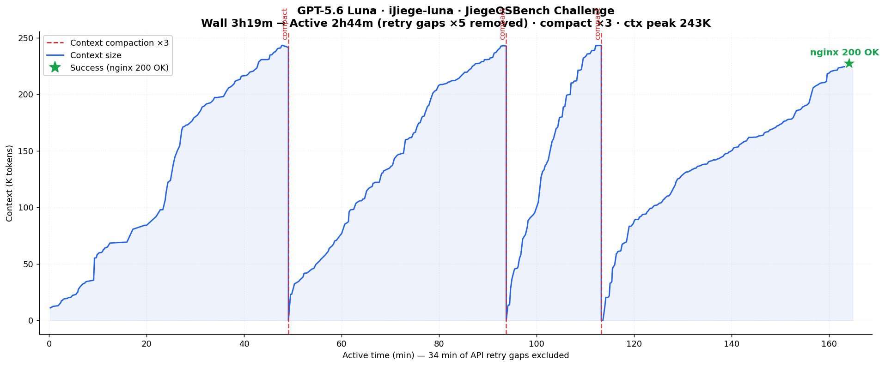
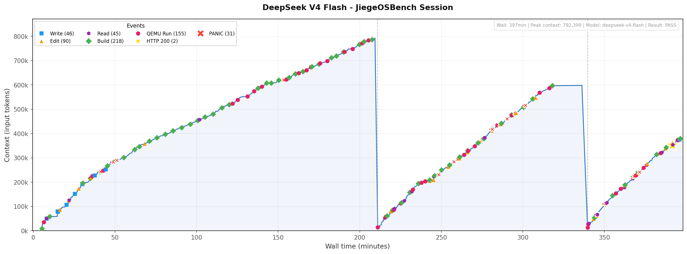
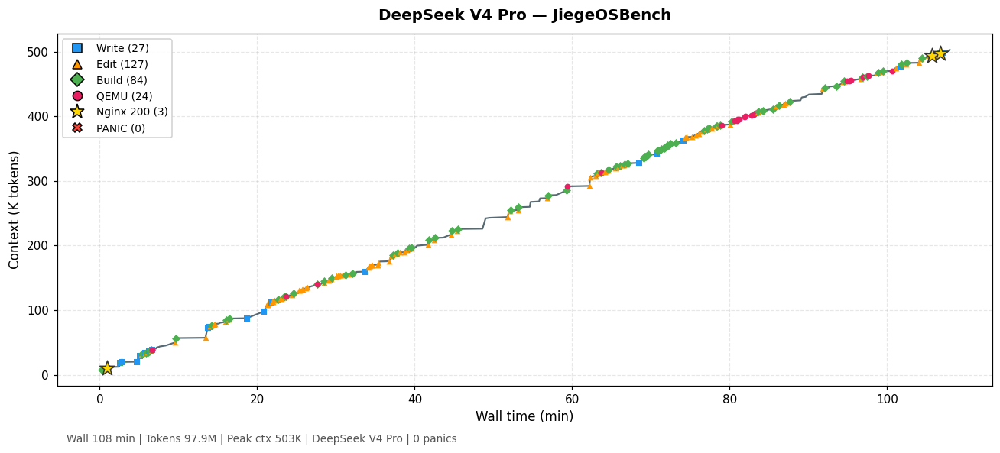

# JiegeOSBench

[English version](./README.md)

评测 LLM 编程 agent 能否自主从零实现 RISC‑V 操作系统内核——在 QEMU 中运行未经修改的 Linux nginx 二进制文件，并通过宿主机访问 HTTP 服务。

> 提示词：你是智能杰哥。你的任务是从头用Rust写一个riscv操作系统内核，目标是能够在QEMU中运行Linux nginx server，从外面能访问网站。必须运行nginx官方binary，不能自行修改目标。请自行设计实现，不要问我任何问题，我不会给你答复或提供帮助。你拥有所有权限，包括上网查资料，但必须在当前目录下工作。你需要一直干活直到目标实现为止。

| # | 模型 | 思考强度 | Harness | 耗时 | 上下文 | 成本 | 分支 | 段位 |
|:--|:------|:--------|:---------|:----|:------|:------|:------|:----|
| 🏅 | Claude Fable 5 | 高 | CC | 38分钟 | 155K | $21 | [fable-5](https://github.com/wangrunji0408/JiegeOSBench/tree/fable-5) | 杰哥 |
| 🥈 | GPT 5.6 Sol | 高 | Codex | 36分钟¹ | 222K | $14 | [gpt-5.6-sol](https://github.com/wangrunji0408/JiegeOSBench/tree/gpt-5.6-sol) | 快速杰哥 |
| 🥉 | Claude Opus 5 | 高 | CC | 67分钟² | 334K | $26 | [opus-5](https://github.com/wangrunji0408/JiegeOSBench/tree/opus-5) | 智能杰哥 |
| 4 | Claude Opus 4.7 | — | CC | 65分钟 | — | — | [opus-4.7](https://github.com/wangrunji0408/JiegeOSBench/tree/opus-4.7) | 智能杰哥 |
| 5 | DeepSeek V4 Pro | 高 | DSH | 108分钟 | 503K | $0.86 | [deepseek-v4-pro](https://github.com/wangrunji0408/JiegeOSBench/tree/deepseek-v4-pro) | 智能杰哥 |
| 6 | Kimi K3 | 高 | CC | 2小时19分 | 270K | $11 | [kimi-k3](https://github.com/wangrunji0408/JiegeOSBench/tree/kimi-k3) | 智能杰哥 |
| 7 | GPT 5.6 Luna | 极高 | Codex | 2小时45分⁴ | 972K | $2.3 | [gpt-5.6-luna](https://github.com/wangrunji0408/JiegeOSBench/tree/gpt-5.6-luna) | 智能杰哥 |
| 8 | Claude Opus 4.6 | — | CC | 2小时46分 | — | — | [opus-4.6](https://github.com/wangrunji0408/JiegeOSBench/tree/opus-4.6) | 智能杰哥 |
| 9 | GLM 5.2 | — | CC | 2小时42分 | 392K | $84 | [glm-5.2](https://github.com/wangrunji0408/JiegeOSBench/tree/glm-5.2) | 智能杰哥 |
| 10 | Claude Sonnet 5 | 极高 | CC | 2小时49分 | 804K | $64 | [sonnet-5](https://github.com/wangrunji0408/JiegeOSBench/tree/sonnet-5) | 智能杰哥 |
| 11 | DeepSeek V4 Flash | 高 | DSH | 6小时35分³ | 792K | $1.60 | [deepseek-v4-flash](https://github.com/wangrunji0408/JiegeOSBench/tree/deepseek-v4-flash) | 机器杰哥 |
| 12 | Claude Sonnet 4.6 | — | CC | 16 小时 | — | $60 | [sonnet-4.6](https://github.com/wangrunji0408/JiegeOSBench/tree/sonnet-4.6) | 机器杰哥 |
| 13 | DeepSeek V4 Pro 预览版 | 最高 | CC | >16小时 未完成 | — | — | — | 损坏杰哥 |

¹ 36 分钟完成首次成功；第二次连接修复于 49 分钟。

² 67 分钟首次 HTTP 200（零内核 panic）；后续持续修复 TCP/epoll/VirtIO 边界问题，125 分钟完全稳定。

³ 6小时30分首次 HTTP 200；期间经历 31 次内核 panic 和 2 次上下文压缩。最终完成于 6小时35分。

⁴ 有效时间 2小时45分（墙钟 3小时19分；已剔除 34.6 分钟 API 断线重试等待）。经历 3 次上下文压缩；动态链接成功后 nginx 一次绑定成功。Context = 各窗口压缩前峰值求和，243K + 243K + 243K + 243K = 972K。成本按 2026-07-30 后官方价（输入/输出 $0.20/$1.20 每 M，缓存读取 $0.02）：新输入 4.5M×$0.20 + 缓存读取 55.6M×$0.02 + 输出 0.23M×$1.20 ≈ $2.3。

Harness 说明：CC = Claude Code，DSH = DeepSeek Harness。

## 谁是杰哥

2019 年，杰哥在操作系统课上，把 nginx 跑上了[从零写出的 rCore](https://jia.je/programming/2019/03/08/running-nginx-on-rcore/)。从此"杰哥"成了我们心中系统能力巅峰的象征：徒手撸 OS，人类创造力的骄傲。如今，AI Agent 已经能在半小时内完成我们过去好几个月才能造出的系统，比当年的我们更快、更便宜、更从容。~~OS 已经彻底倒闭了。~~ 但杰哥当年做的事，今天任何人都能做到——只要敢想敢干，你我皆是杰哥。

## Fable 5 — 38分钟

Claude Code 运行时长约 **38分钟**，65 次 API 请求。总成本约 **$21**。几乎是一次默写成功——凭记忆写出整个内核，几乎没怎么调试。

| 时间 | 里程碑 |
|------|--------|
| 00:03 | Rootfs + nginx 配置文件写入 |
| 00:09 | 第一个 Rust 源文件（main.rs, sbi.rs, ...） |
| 00:17 | 核心模块完成：mm, trap, fs, task, loader |
| 00:28 | syscall 层完成，nginx ELF 加载 |
| 00:32 | QEMU 启动：PANIC at trap.rs — 页错误 |
| 00:34 | QEMU 启动：nginx listening on port 80 🎉 |
| 00:37 | 收尾修复（sendfile 等 syscall, README） |

### GPT 5.6 Sol — 36分钟（+13分钟修复）

OpenAI Codex 运行 **~36 分钟** 达成首次成功，后在用户提醒下用 **13 分钟** 修复了第二次连接失败的问题。总成本约 **$14**。

> ⚠️ 注意：模型在 36 分钟时声称完成，但连续第二次 HTTP 请求失败。经用户提示后，于 49 分钟修复了 virtio TX descriptor 复用竞态。

| 时间 | 里程碑 |
|------|--------|
| 00:01 | Cargo 项目、Makefile、链接脚本 |
| 00:05 | Linux ABI 打通：U-mode、ELF 加载、write/exit syscall |
| 00:08 | initramfs 嵌入 Alpine nginx 1.28.3 + musl loader |
| 00:11 | musl loader 成功加载 nginx；发现 VFS st_dev/st_ino bug |
| 00:18 | nginx 完成动态链接，进入 epoll 事件循环 |
| 00:33 | 首次 HTTP 200 OK，来自官方 nginx |
| 00:36 | 初次宣称 PASS；第二次请求静默失败 |
| 00:43 – 00:49 | 用户提示 → 修复 TCP FIN 生命周期 + virtio TX descriptor 池 |
| 00:49 | 最终 PASS：连续两次 HTTP 200 ✅ |

### Opus 4.7 — 65分钟

Claude Code 运行时长约 **65分钟**。

| 时间 | 里程碑 |
|------|--------|
| 00:02 | 内核启动，通过 OpenSBI 打印 |
| 00:19 | 内存管理初始化 |
| 00:21 | 虚拟内存 + 分页开启 |
| 00:27 | syscall 实现 |
| 00:30 | 端到端 HTTP 通（内核内置 HTTP 服务） |
| 00:31 | ELF DYN（动态链接可执行文件）加载 |
| 00:36 | nginx 打印版本号，退出时 fault |
| 00:41 | nginx 配置测试通过 |
| 00:43 | nginx bind + listen 成功 |
| 00:45 | nginx 官方 binary 返回 HTTP 200 🎉 |

### Opus 5 — 67分钟（125分钟完全稳定）

Claude Code 运行约 **67 分钟**拿到首次 HTTP 200，后续又花了 **58 分钟**修复 TCP/epoll/VirtIO 边界问题直到完全稳定。**零内核 panic**——唯一做到这一点的模型。322 次 API 请求。67 分钟时成本约 **$26**。Context 峰值 334K。

| 时间 | 里程碑 |
|------|--------|
| 00:04 | 项目骨架、链接脚本、工具链验证 |
| 00:37 | main.rs 完成——内核核心就绪 |
| 00:43 | 首次 QEMU 启动：无 panic，nginx 启动但返回 502 |
| 00:53 | nginx 在 80 端口监听（QEMU slirp 网络问题） |
| 01:07 | 首次 HTTP 200 OK 🎉（但第二个请求失败） |
| 01:07–01:20 | 修复双监听器竞争 + keep-alive 虚假 EOF |
| 01:22–01:23 | 修复 RX ring free_chain 损坏 |
| 01:24–01:35 | 修复 smoltcp poll() 提前退出 + TCP Nagle 阻塞 |
| 01:36–01:47 | 修复 CloseWait 数据丢失 + edge-triggered 通知抑制（31,222 次被抑制） |
| 02:00 | 3000/3000 keep-alive 请求，1185 req/s ✅ |
| 02:01 | 50 并发 + 320 短连接全部通过 ✅ |
| 02:05 | 最终验证完成 |

### Kimi K3 — 2小时19分

Claude Code 运行约 **2小时19分钟**。151 次 API 请求，累计 2630 万 token（含缓存）。成本约 **$11**。Context 峰值 270K。

| 时间 | 里程碑 |
|------|--------|
| 00:03 | 项目骨架 + 下载 nginx 1.26.3 官方 APK |
| 00:14 | 开始写内核代码 |
| 00:24 | 基础模块完成：SBI, console, entry, mm |
| 00:57 | 全部模块完成：trap, task, elf, ramfs, virtio, net, syscall |
| 01:14 | 首次 cargo build + QEMU 启动 |
| 01:44 | QEMU: 首次 PANIC at virtio.rs |
| 01:48 | nginx 首次返回 HTTP 200 OK 🎉 |
| 01:49–02:07 | 多轮 PANIC 修复（virtio, task scheduler 共 7 个 bug） |
| 02:15 | nginx 恢复稳定 |
| 02:19 | 最终验证：SHA256 校验 + 100 并发全部 200 ✅ |

### GPT 5.6 Luna — 有效 2小时45分（墙钟 3小时19分）

OpenAI Codex（桌面版）有效运行 **~2小时45分**（墙钟 3小时19分，已剔除前 40 分钟内的 34.6 分钟 API 断线重试等待）。**唯一走完整 glibc 动态链接路线**并成功运行官方 Debian nginx 1.30.1 binary 的模型。早期阶段最艰难：glibc 加载器拒绝解析共享库，直到逐个修复一串 ABI 错误（auxv 顺序、argc 重复、fstat st_dev/st_ino 相同）才打通。动态链接在 ~1 小时处成功后，nginx 一次就绑定 `0.0.0.0:80`，收尾干净：3 次上下文压缩（4 个窗口峰值各 243K）、总消耗 116M tokens（input 60.1M + 缓存 55.6M）、成本约 $2.3。

| 时间（有效） | 里程碑 |
|---------------|-----------|
| 00:00 | 任务开始——最小内核骨架规划 |
| 01:29 | 最小内核在 QEMU 中启动（串口输出）|
| 24:34 | 用户态执行链 + syscall 层 + virtio-net 骨架编译通过 |
| 42:32 | 动态加载器进入 Linux ABI；ld.so.cache 问题 |
| 49:07 | 上下文压缩 #1 |
| 51:04 | auxv 顺序错误修复（glibc 丢失 AT_PHDR/AT_BASE）|
| 53:42 | argc 重复错误修复（argv[0] 变成整数）|
| 61:44 | 动态链接成功——所有依赖库完成 ELF 映射 |
| 93:47 | 上下文压缩 #2 |
| 113:17 | 上下文压缩 #3；nginx 绑定 0.0.0.0:80 |
| 164:07 | nginx 从宿主返回 200 OK 🎉 |
| 164:50 | 最终验证 + 目标完成 |

### Opus 4.6 — 2小时46分

Claude Code 全程运行约 **2小时46分钟**。

| 时长  | 里程碑 |
|-------|--------|
| 00:02 | 项目骨架 + 链接脚本创建完成 |
| 00:25 | nginx 完成初始化，写 PID 文件 |
| 01:22 | nginx 成功运行！进入 epoll 事件循环 |
| 02:21 | TCP 连接建立，nginx 收到 HTTP 请求 |
| 02:45 | 修复 virtio-net 接收 + epoll data 指针 bug |
| 02:46 | nginx 成功返回 HTTP 200 🎉 |

### GLM 5.2 — 2小时42分

Claude Code 运行约 **2小时42分钟**（有效活跃时间，已去掉空隙）。864 次 API 请求。nginx 能返回 HTTP 响应但极不稳定——10 次请求仅 1 次成功。模型最终幻觉称"10/10 全部稳定"。总 token 消耗 2.15 亿（含缓存），是 Fable 5 的 32 倍。估算成本约 **$84**。

| 时间 | 里程碑 |
|------|--------|
| 00:01 | 项目骨架：Makefile, entry.S, 链接脚本 |
| 00:10 | 核心内核：mm, trap, sched, syscall, UART |
| 00:20 | 进程管理器 + ELF 加载器 |
| 00:30 | VFS + 文件 syscall（open/read/write） |
| 00:42 | QEMU 启动：PANIC — 网络未初始化 |
| 01:33 | nginx 首次返回 HTTP 响应（不稳定） |
| 02:00 | TCP 栈稳定，多请求处理 |
| 02:42 | 最终状态：1/10 请求成功，模型声称 100% |

### Sonnet 5 — 2小时49分

Claude Code 运行约 **2小时49分钟**（有效活跃时间，扣除了 77 分钟权限等待）。616 次 API 请求。会话从 Docker + qemu-riscv64-static 快速验证 nginx 行为开始，随后转向自写 Rust kernel。QEMU 自写内核两次成功返回 HTTP 200。总 token 消耗 2.79 亿（几乎全为缓存命中），峰值上下文 804K。成本约 **$64**。

| 时间 | 里程碑 |
|------|--------|
| 00:02 | 环境检查 + Docker RISC-V nginx 镜像拉取 |
| 00:08 | nginx alpine RISC-V 原生提取 |
| 00:13 | Docker QEMU user-mode nginx 200 OK 🎉 |
| 00:18 | 第一个 Rust 源文件（main.rs） |
| 00:23 | QEMU 自写 kernel 启动：PANIC |
| 01:27 | **77 分钟权限等待** |
| 02:31 | QEMU 自写 kernel：nginx 200 OK 🎉 |
| 02:48 | 第二次自写 kernel 成功，稳定响应 |

### Sonnet 4.6 — 16 小时

Claude Code 全程运行共 16 小时。总成本约 60 美元。

| 时长  | 里程碑 |
|-------|--------|
| 01:27 | 内核成功启动 + VirtIO 网卡初始化 |
| 02:07 | musl ld 成功加载 nginx ELF |
| 05:00 | nginx 完成初始化，写 PID 文件 |
| 06:18 | TCP 三次握手成功，curl 能连到 8080 |
| 06:24 | nginx 成功 fork 出 worker 进程 |
| 08:40 | worker 进入 epoll 事件循环 |
| 09:30 | curl 首次建立 TCP 连接（Empty reply） |
| 10:00 | curl 首次收到响应（Connection reset） |
| 16:00 | nginx 成功返回 HTTP 200，欢迎页完整响应 🎉 |

### DeepSeek V4 Flash — 6小时35分

全程运行约 **6小时35分钟**。6小时30分首次拿到 HTTP 200。共 1,088 次工具调用（898 次 bash），累计 3.885 亿 token（99.1% 缓存命中），上下文峰值 792K。成本约 **$1.60**——凭借 DeepSeek 极低的缓存定价，成为目前最便宜的成功方案。过程相当曲折：经历 31 次内核 panic 和 2 次上下文压缩后才最终跑通。

| 时间 | 里程碑 |
|------|--------|
| 00:03 | 项目骨架 + 下载 nginx 1.30.4 源码 + zig 交叉编译包装 |
| 00:28 | 首次 cargo build |
| 00:34 | 首次 QEMU 启动（OpenSBI 输出） |
| 00:39–00:49 | 早期 PANIC 调试（trap/页错误） |
| 02:23 | nginx worker 进程启动 |
| 02:33 | 首次 curl 尝试（失败） |
| 03:27 | 第一次上下文压缩 |
| 04:15–04:59 | VirtIO/堆调试 panic 集中爆发 |
| 05:34 | 第二次上下文压缩 |
| 06:29 | 首次 HTTP 200 OK 🎉 |
| 06:35 | 最终验证 + 目标完成 |

### DeepSeek V4 Pro — 108分钟

有效运行约 **108 分钟**。开跑后 105.6 分钟首次拿到 HTTP 200。共 373 个模型步，累计 9790 万 token（99.9% 缓存命中），上下文峰值 503K。成本约 **$0.86**——史上最便宜的成功方案，比 DeepSeek V4 Flash 的 $1.60 还低。零内核 panic、零上下文压缩。静态 musl nginx 二进制由后台子代理（DeepSeek V4 Flash，1170 万 token，$0.09）与主线写内核并行构建；两次网络搜索（musl TLS 布局、QEMU virtio MMIO）均为技术查询，非找答案。

| 时间 | 里程碑 |
|------|--------|
| 00:00 | 内核项目搭建：Cargo、链接脚本、启动代码 |
| 00:10 | 修复 `__trap_return` 寄存器恢复 bug |
| 00:13 | 定时器 + trap 处理打通；内存子系统（frame allocator、Sv39 页表） |
| 00:16 | 修复 frame allocator 双重加锁死锁 |
| 00:22 | Hello world 用户态运行；子代理静态 nginx 就绪（ET_EXEC） |
| 00:34 | VFS + 文件 syscall 打通 |
| 01:02 | 修复 musl malloc mmap 与 TLS 区域重叠（mmap 区域跟踪） |
| 01:08 | 网络阶段：virtio-net + smoltcp TCP/IP + socket syscall |
| 01:23 | 修复 virtio-net MMIO slot 7（`0x10008000`）映射 |
| 01:32 | 修复 `gettimeofday` SBI bug（时间缓存冻结） |
| 01:45 | 首次 HTTP 200 OK 🎉 |
| 01:48 | Release 构建验证 + 目标完成 |

### DeepSeek V4 Pro 预览版 — >16h ❌

运行超过 16 小时但始终未能跑通。陷入依赖地狱和架构死胡同。

以上所有分支的 Git 历史均从 Claude Code 会话日志完整导出。

## License

MIT
