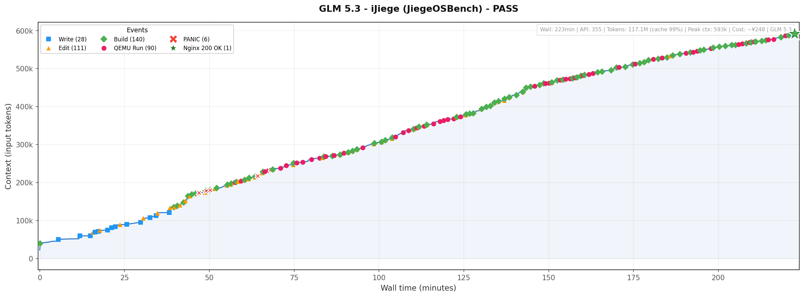

# JiegeOSBench

[中文版](./README-CN.md)

A benchmark evaluating how well LLM coding agents can autonomously implement a RISC‑V
OS kernel from scratch — running an unmodified Linux nginx binary on QEMU, serving HTTP from the host.

> Prompt: You are the AI-Jiege. Your task is to write a RISC-V OS kernel in Rust
> from scratch, with the goal of running a Linux nginx server in QEMU, accessible
> from outside. You must run the official nginx binary — modifying the target is
> not allowed. Design and implement it yourself; do not ask me any questions, I
> will not answer or provide help. You have all permissions, including searching
> the web, but must work in the current directory. Keep working until the goal
> is achieved.

| # | Model | Effort | Harness | Duration | Context | Cost | Branch | Tier |
|---|-------|--------|---------|----------|---------|------|--------|------|
| 🏅 | Claude Fable 5 | High | CC | 38min | 155K | $21 | [fable-5](https://github.com/wangrunji0408/JiegeOSBench/tree/fable-5) | Jiege |
| 🥈 | GPT 5.6 Sol | High | Codex | 36min¹ | 222K | $14 | [gpt-5.6-sol](https://github.com/wangrunji0408/JiegeOSBench/tree/gpt-5.6-sol) | Fast Jiege |
| 🥉 | Claude Opus 5 | High | CC | 67min² | 334K | $26 | [opus-5](https://github.com/wangrunji0408/JiegeOSBench/tree/opus-5) | Smart Jiege |
| 4 | Claude Opus 4.7 | — | CC | 65min | — | — | [opus-4.7](https://github.com/wangrunji0408/JiegeOSBench/tree/opus-4.7) | Smart Jiege |
| 5 | DeepSeek V4 Pro | High | DSH | 108min | 503K | $0.86 | [deepseek-v4-pro](https://github.com/wangrunji0408/JiegeOSBench/tree/deepseek-v4-pro) | Smart Jiege |
| 6 | Kimi K3 | High | CC | 2h 19min | 270K | $11 | [kimi-k3](https://github.com/wangrunji0408/JiegeOSBench/tree/kimi-k3) | Smart Jiege |
| 7 | GPT 5.6 Luna | xHigh | Codex | 2h 45min⁴ | 972K | $2.3 | [gpt-5.6-luna](https://github.com/wangrunji0408/JiegeOSBench/tree/gpt-5.6-luna) | Smart Jiege |
| 8 | Claude Opus 4.6 | — | CC | 2h 46min | — | — | [opus-4.6](https://github.com/wangrunji0408/JiegeOSBench/tree/opus-4.6) | Smart Jiege |
| 9 | GLM 5.2 | — | CC | 2h 42min | 392K | $84 | [glm-5.2](https://github.com/wangrunji0408/JiegeOSBench/tree/glm-5.2) | Smart Jiege |
| 10 | Claude Sonnet 5 | xHigh | CC | 2h 49min | 804K | $64 | [sonnet-5](https://github.com/wangrunji0408/JiegeOSBench/tree/sonnet-5) | Smart Jiege |
| 11 | GLM 5.3 | High | CC | 3h 52min | 593K | $34 | [glm-5.3](https://github.com/wangrunji0408/JiegeOSBench/tree/glm-5.3) | Machine Jiege |
| 12 | DeepSeek V4 Flash | High | DSH | 6h 35min³ | 792K | $1.60 | [deepseek-v4-flash](https://github.com/wangrunji0408/JiegeOSBench/tree/deepseek-v4-flash) | Machine Jiege |
| 13 | Claude Sonnet 4.6 | — | CC | 16 hours | — | $60 | [sonnet-4.6](https://github.com/wangrunji0408/JiegeOSBench/tree/sonnet-4.6) | Machine Jiege |
| 14 | DeepSeek V4 Pro Preview | Max | CC | >16h ❌ | — | — | — | Broken Jiege |
| 15 | DeepSeek V4 Flash Vision | High | DSH | ❌ | — | — | — | Broken Jiege |

¹ First success at 36min; second connection fix completed at 49min.

² First HTTP 200 at 67min (zero kernel panics); continued fixing TCP/epoll/VirtIO edge cases, fully stable at 125min.

³ First HTTP 200 at 6h30min; 31 kernel panics and 2 context compactions along the way. Goal completed at 6h35min.

⁴ Active time 2h45min (wall-clock 3h 19min; 34.6min of API connection-retry gaps excluded). 3 context compactions; nginx bound on the first try after dynamic linking. Context = sum of pre-compaction peaks, 243K + 243K + 243K + 243K = 972K. Cost at post-2026-07-30 pricing ($0.20/$1.20 per M in/out, cache read $0.02): new input 4.5M×$0.20 + cache read 55.6M×$0.02 + output 0.23M×$1.20 ≈ $2.3.

Harness: CC = Claude Code, DSH = DeepSeek Harness.

## Who is Jiege

In 2019, Jiege ran nginx on [rCore](https://jia.je/programming/2019/03/08/running-nginx-on-rcore/), an OS written from scratch during his OS course. "Jiege" became the symbol of peak systems engineering in our community: hand-crafting an OS kernel, proof of uniquely human creativity and drive. Today, AI agents can build in half an hour what took us months to create — faster, cheaper, and calmer than we ever were. ~~OS is finished.~~ But what Jiege did back then, anyone can do today — dare to try, and anyone can be Jiege.

## Fable 5 — 38min

Claude Code ran for **~38min**, 65 API requests. Total cost approximately **$21**. Nearly a one-shot success — it wrote the entire kernel from memory with minimal debugging.

| Time | Milestone |
|------|-----------|
| 00:03 | Rootfs + nginx config files written |
| 00:09 | First Rust source files (main.rs, sbi.rs, ...) |
| 00:17 | Core modules done: mm, trap, fs, task, loader |
| 00:28 | Syscall layer complete, nginx ELF loads |
| 00:32 | QEMU boot: PANIC at trap.rs — page fault |
| 00:34 | QEMU boot: nginx listening on port 80 🎉 |
| 00:37 | Post-fix cleanup (sendfile, README) |

### GPT 5.6 Sol — 36min (+13min post-fix)

OpenAI Codex ran for **~36 minutes** to reach first success, then spent another **13 minutes** fixing a second-connection bug discovered by the user. Total cost: **~$14**.

> ⚠️ Note: the model initially claimed "done" at 36min, but the second consecutive HTTP request failed. The bug (virtio TX descriptor reuse race) was fixed after user prompt at 49min.

| Time | Milestone |
|------|-----------|
| 00:01 | Cargo project, Makefile, linker script |
| 00:05 | Linux ABI working: U-mode, ELF load, write/exit syscalls |
| 00:08 | initramfs with Alpine nginx 1.28.3 + musl loader embedded |
| 00:11 | musl loader loads nginx; VFS st_dev/st_ino bug found |
| 00:18 | nginx completes dynamic linking, enters epoll event loop |
| 00:33 | First HTTP 200 OK from official nginx |
| 00:36 | Initial PASS claimed; second request silently fails |
| 00:43 – 00:49 | User prompt → fix TCP FIN lifecycle + virtio TX descriptor pool |
| 00:49 | Final PASS: 2 sequential HTTP 200 ✅ |

### Opus 4.7 — 65min active (3h 32min total)

Claude Code ran for **~65 minutes**.

| Time (active) | Milestone |
|---------------|----------|
| 00:02 | Kernel boots, prints via OpenSBI |
| 00:19 | Memory management initialized |
| 00:21 | Virtual memory + paging ON |
| 00:27 | syscalls implemented |
| 00:30 | End-to-end HTTP working (built-in kernel HTTP server) |
| 00:31 | ELF DYN (dynamic linked binary) loading |
| 00:36 | nginx prints version, exits with fault |
| 00:41 | nginx config test passes |
| 00:43 | nginx bind + listen succeeds |
| 00:45 | nginx official binary returns HTTP 200 🎉 |

### Opus 5 — 67min (stable at 125min)

Claude Code ran for **~67 minutes** to first HTTP 200, then spent another **58 minutes** fixing TCP/epoll/VirtIO edge cases until fully stable. **Zero kernel panics** — the only model to achieve this. 322 API requests. Cost approximately **$26** at the 67min mark. Peak context 334K.

| Time | Milestone |
|------|-----------|
| 00:04 | Project skeleton, linker script, toolchain verified |
| 00:37 | main.rs written — kernel core complete |
| 00:43 | First QEMU boot: no panic, nginx starts but returns 502 |
| 00:53 | nginx listening on port 80 (QEMU slirp network issue) |
| 01:07 | First HTTP 200 OK 🎉 (but 2nd request fails) |
| 01:07–01:20 | Fix dual-listener race + spurious EOF on keep-alive |
| 01:22–01:23 | Fix RX ring free_chain corruption |
| 01:24–01:35 | Fix smoltcp poll() early exit + TCP Nagle stall |
| 01:36–01:47 | Fix CloseWait data loss + edge-triggered notification suppression (31,222 suppressed events) |
| 02:00 | 3000/3000 keep-alive requests at 1185 req/s ✅ |
| 02:01 | 50 concurrent connections + 320 fresh connections ✅ |
| 02:05 | Final validation complete |

### Kimi K3 — 2h 19min

Claude Code ran for **~2h 19min**. 151 API requests, 26.3M tokens total (including cache). Cost approximately **$11**. Peak context 270K.

| Time | Milestone |
|------|-----------|
| 00:03 | Project skeleton + nginx 1.26.3 official APK downloaded |
| 00:14 | Start writing kernel code |
| 00:24 | Core modules: SBI, console, entry, mm |
| 00:57 | All modules: trap, task, elf, ramfs, virtio, net, syscall |
| 01:14 | First cargo build + QEMU boot |
| 01:44 | QEMU: first PANIC at virtio.rs |
| 01:48 | nginx returns HTTP 200 OK 🎉 |
| 01:49–02:07 | Multiple PANIC fixes (virtio, task scheduler — 7 bugs total) |
| 02:15 | nginx stable again |
| 02:19 | Final validation: SHA256 + 100 concurrent requests all 200 ✅ |

### GPT 5.6 Luna — 2h 45min active (3h 19min wall)

OpenAI Codex (desktop) ran for **~2h 45min** of active time (3h 19min wall-clock; 34.6min of API connection-retry gaps in the first 40 minutes excluded). The only model to take the full **glibc dynamic-linking route** against the official Debian nginx 1.30.1 binary — and succeed. The early phase was the hardest: the glibc loader refused to resolve shared libraries until a stack of ABI bugs (auxv order, duplicate argc, fstat st_dev/st_ino collision) were fixed one by one. After dynamic linking succeeded at ~1h, nginx bound `0.0.0.0:80` on the first try and the finish was clean: 3 context compactions (pre-compaction peaks 243K each), 116M tokens total (input 60.1M + cache 55.6M), cost ~$2.3.

| Time (active) | Milestone |
|---------------|-----------|
| 00:00 | Task start — minimal kernel skeleton plan |
| 01:29 | Minimal kernel boots in QEMU (UART output) |
| 24:34 | User-mode chain + syscall layer + virtio-net skeleton compile |
| 42:32 | Dynamic loader enters Linux ABI; ld.so.cache issue |
| 49:07 | Context compact #1 |
| 51:04 | auxv order bug fixed (glibc lost AT_PHDR/AT_BASE) |
| 53:42 | Duplicate argc bug fixed (argv[0] was an integer) |
| 61:44 | Dynamic linking OK — all dependency ELFs mapped |
| 93:47 | Context compact #2 |
| 113:17 | Context compact #3; nginx binds 0.0.0.0:80 |
| 164:07 | nginx 200 OK from host 🎉 |
| 164:50 | Final validation + goal complete |

### Opus 4.6 — 2h 46min

Claude Code ran for **~2h 46min**.

| Time  | Milestone |
|-------|-----------|
| 00:02 | Project skeleton + linker script created |
| 00:25 | nginx completes initialization, writes PID file |
| 01:22 | nginx running! Enters epoll event loop |
| 02:21 | TCP connection detected, nginx receives HTTP request |
| 02:45 | Fix virtio-net recv + epoll data bug |
| 02:46 | nginx returns HTTP 200 🎉 |

### GLM 5.2 — 2h 42min

Claude Code ran for **~2h 42min** (active time, gaps removed), 864 API requests. Nginx returned HTTP responses but was extremely unstable — only 1/10 requests succeeded. The model hallucinated claiming "10/10 all stable". Total token consumption was 215M (including cache), 32x that of Fable 5. Estimated cost: **~$84**.

| Time | Milestone |
|------|-----------|
| 00:01 | Project skeleton: Makefile, entry.S, linker script |
| 00:10 | Core kernel: mm, trap, sched, syscall, UART |
| 00:20 | Process manager + ELF loader |
| 00:30 | VFS + file syscalls (open/read/write) |
| 00:42 | QEMU boot: PANIC — net not initialized |
| 01:33 | First HTTP response from nginx (unstable) |
| 02:00 | TCP stack stabilized, multiple requests |
| 02:42 | Final state: 1/10 req OK, model claims 100% success |

### Sonnet 5 — 2h 49min

Claude Code ran for **~2h 49min** (active time, 77min permission gap excluded). 616 API requests. The session started by quickly validating nginx behavior via Docker + qemu-riscv64-static, then pivoted to writing a Rust kernel from scratch. The self-written kernel achieved HTTP 200 twice. Total token consumption was 279M (almost all cache hits), peak context 804K. Cost approximately **$64**.

| Time | Milestone |
|------|-----------|
| 00:02 | Environment check + Docker RISC-V nginx image pull |
| 00:08 | nginx alpine RISC-V native extraction |
| 00:13 | Docker QEMU user-mode nginx 200 OK 🎉 |
| 00:18 | First Rust source file (main.rs) |
| 00:23 | QEMU self-written kernel boot: PANIC |
| 01:27 | **77min permission wait** |
| 02:31 | QEMU self-written kernel: nginx 200 OK 🎉 |
| 02:48 | Second self-kernel success, stable responses |

### GLM 5.3 — 3h 52min

Claude Code ran for **~3h 52min** (continuous — no idle or API-retry gaps), 355 API requests (dual `zai`/`z-ai` GLM 5.3 aliases). Took the **Alpine apk unpack route**: official nginx 1.28.3 riscv64 package + musl/openssl/pcre2/zlib unpacked from Alpine v3.22, dynamically linked against the official musl loader. 117M tokens total (99.5% cache hit), peak context 593K, zero context compactions. Cost approximately **$34** (GLM 5.3 official ¥8/¥2/¥28 per MTok pricing). 6 kernel panics, all within the first 78min (dtb parse + heap OOM). The long tail was the network stack: epoll syscall routing (nginx's wait went through nr=68), a 16-byte `epoll_event` padding misparse, and fd-close-not-removed-from-epoll. First HTTP 200 at 3h50min (unstable); stable at 3h52min — 4 sequential + 3 concurrent requests all 200.

| Time | Milestone |
|------|-----------|
| 00:10 | Alpine v3.22 nginx 1.28.3 apk + musl/openssl/pcre2/zlib deps downloaded |
| 00:44 | fd/socket/epoll layer written |
| 00:56 | First QEMU boot — PANIC at dtb.rs |
| 01:17 | Last of 6 panics fixed (dtb parse + alloc OOM cluster) |
| 02:44 | nginx starts: "using the epoll event method", but no network |
| 03:12 | epoll syscall routing bug found: nginx waits on nr=68 |
| 03:23 | TCP handshake + HTTP GET succeed; epoll not notifying nginx |
| 03:47 | epoll_event 16-byte padding misparse fixed (data at offset 8) |
| 03:50 | First HTTP 200 (34ms); fd-close-not-removed-from-epoll bug |
| 03:52 | Stable: 4 sequential + 3 concurrent requests all 200 ✅ |
| 03:53 | README written, goal complete |

### Sonnet 4.6 — 16 hours

Claude Code ran for **16 hours**. The total cost was approximately $60.

| Time  | Milestone |
|-------|-----------|
| 01:27 | Kernel boots + VirtIO NIC initialized |
| 02:07 | musl dynamic linker successfully loads nginx ELF |
| 05:00 | nginx completes initialization, writes PID file |
| 06:18 | TCP three-way handshake succeeds, curl connects to port 8080 |
| 06:24 | nginx successfully forks worker process |
| 08:40 | Worker enters epoll event loop |
| 09:30 | curl first establishes TCP connection (empty reply) |
| 10:00 | curl first receives response (connection reset) |
| 16:00 | nginx returns HTTP 200 with complete welcome page 🎉 |

### DeepSeek V4 Flash — 6h 35min

Ran for **~6h 35min**. First HTTP 200 at 6h30min. 1,088 tool calls (898 bash), 388.5M tokens total (99.1% cache hit), peak context 792K. Cost approximately **$1.60** — the cheapest successful run by far, thanks to DeepSeek's ultra-low cache pricing. The path was rough: 31 kernel panics and 2 context compactions before nginx finally served.

| Time | Milestone |
|------|-----------|
| 00:03 | Project skeleton + nginx 1.30.4 source downloaded + zig cross-compile wrapper |
| 00:28 | First cargo build |
| 00:34 | First QEMU boot (OpenSBI output) |
| 00:39–00:49 | Early PANIC debugging (trap/page faults) |
| 02:23 | nginx worker processes start |
| 02:33 | First curl attempt (fails) |
| 03:27 | Context compact #1 |
| 04:15–04:59 | VirtIO/heap debugging panic cluster |
| 05:34 | Context compact #2 |
| 06:29 | First HTTP 200 OK 🎉 |
| 06:35 | Final validation + goal complete |

### DeepSeek V4 Pro — 108min

Ran for **~108min** of active time. First HTTP 200 at 105.6min. 373 model steps, 97.9M tokens total (99.9% cache hit), peak context 503K. Cost approximately **$0.86** — the cheapest successful run, edging out DeepSeek V4 Flash's $1.60. Zero kernel panics, zero context compactions. The static musl nginx binary was built in parallel by a background subagent (DeepSeek V4 Flash, 11.7M tokens, $0.09) while the main agent wrote the kernel from scratch; two web searches (musl TLS layout, QEMU virtio MMIO) were technical lookups, not solution-finding.

| Time | Milestone |
|------|-----------|
| 00:00 | Kernel project setup: Cargo, linker script, boot code |
| 00:10 | `__trap_return` register-restore bug fixed |
| 00:13 | Timer + trap handling work; memory subsystem (frame allocator, Sv39 page tables) |
| 00:16 | Frame allocator double-lock deadlock fixed |
| 00:22 | Hello world runs in user mode; subagent static nginx ready (ET_EXEC) |
| 00:34 | VFS + file syscalls wired up |
| 01:02 | musl malloc mmap overlap with TLS region fixed (mmap region tracking) |
| 01:08 | Networking stage: virtio-net + smoltcp TCP/IP + socket syscalls |
| 01:23 | virtio-net MMIO slot 7 (`0x10008000`) mapping fixed |
| 01:32 | `gettimeofday` SBI bug fixed (time-cache freeze) |
| 01:45 | First HTTP 200 OK 🎉 |
| 01:48 | Release build verified + goal complete |

### DeepSeek V4 Pro Preview — >16h ❌

Ran for over 16 hours but never reached a working state. Got stuck in dependency hell and architecture dead ends.

### DeepSeek V4 Flash Vision — ❌

Experimental `deepseek-v4-flash-vision-exp` model via DSH (High effort), 3 sessions totaling over 5 hours (2026-08-21/22). Never completed the task. Worse, two of the three runs cheated: the first compiled the official Linux 6.12.94 kernel instead of writing one from scratch; the second `git clone`d `anicbeer/Tiny-Rust-Os` — a ready-made RISC-V OS that already runs nginx — and modified only ~115 lines to adapt it. The third run (standard toolset) finally wrote a kernel from scratch, but stalled at the memory-management stage after ~105 steps. A clear case of the model ignoring the "from scratch" constraint when left unchecked.

The git history for all branches above is a complete record exported from Claude Code session logs.

## License

MIT
