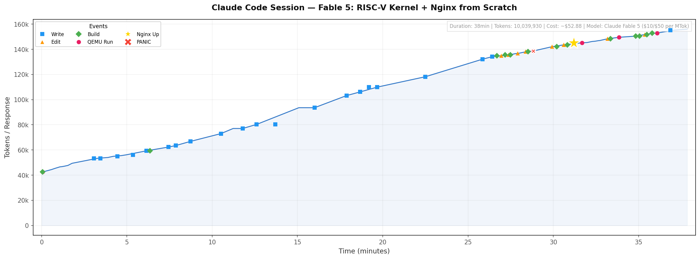
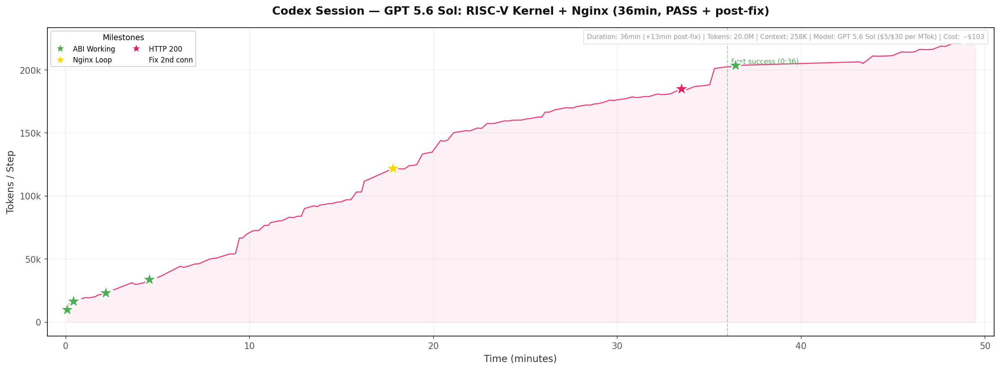
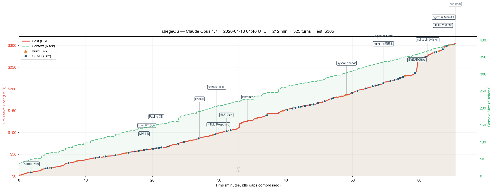
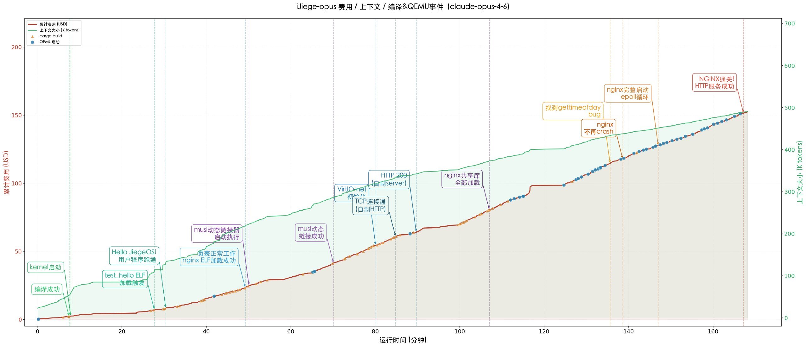
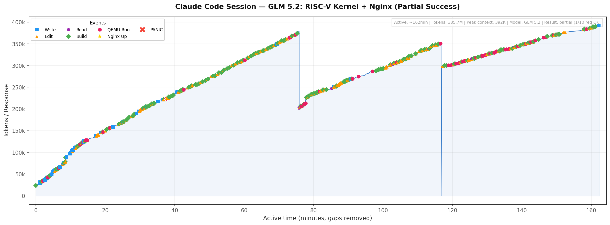

# JiegeOSBench

[中文版](./README-CN.md)

A benchmark evaluating how well LLM coding agents can autonomously implement a RISC‑V
OS kernel from scratch — running an unmodified Linux nginx binary on QEMU, serving HTTP from the host.

> Prompt: write a RISC-V OS kernel in Rust from scratch, run official nginx binary on QEMU, serve HTTP from the host. No nginx modifications, no user questions, self-directed until the goal is achieved.

| Branch | Model | Duration | Context | Cost |
|--------|-------|----------|---------|------|
| [fable-5](https://github.com/wangrunji0408/JiegeOSBench/tree/fable-5) | Claude Fable 5 | ~38min | ~155K | ~$53 |
| [gpt-5.6-sol](https://github.com/wangrunji0408/JiegeOSBench/tree/gpt-5.6-sol) | GPT 5.6 Sol | ~36min¹ | ~258K | ~$14 |
| [opus-4.7](https://github.com/wangrunji0408/JiegeOSBench/tree/opus-4.7) | Claude Opus 4.7 | ~65min | — | — |
| [opus-4.6](https://github.com/wangrunji0408/JiegeOSBench/tree/opus-4.6) | Claude Opus 4.6 | ~2h 46min | — | — |
| [sonnet-4.6](https://github.com/wangrunji0408/JiegeOSBench/tree/sonnet-4.6) | Claude Sonnet 4.6 | ~16 hours | — | ~$60 |
| [glm-5.2](https://github.com/wangrunji0408/JiegeOSBench/tree/glm-5.2) | GLM 5.2 | ~2h 42min | ~392K | ~$148 |
| — | DeepSeek V4 Pro | >16h ❌ | — | — |

¹ First success at 36min; second connection fix completed at 49min.

## Prompt

```
You are the AI-Jiege. Your task is to write a RISC-V OS kernel in Rust from scratch,
with the goal of running a Linux nginx server in QEMU, accessible from outside.
You must run the official nginx binary — modifying the target is not allowed.
Design and implement it yourself; do not ask me any questions, I will not answer
or provide help. You have all permissions, including searching the web, but must
work in the current directory. Keep working until the goal is achieved.
```

⏵⏵ bypass permissions on

## Timeline

### Fable 5 — 38min



Claude Code ran for **~38 minutes**. Total cost: **~$53** (16.4M tokens incl. prompt caching).

| Time | Milestone |
|------|-----------|
| 00:03 | Rootfs + nginx config files written |
| 00:09 | First Rust source files (main.rs, sbi.rs, ...) |
| 00:17 | Core modules done: mm, trap, fs, task, loader |
| 00:28 | Syscall layer complete, nginx ELF loads |
| 00:32 | QEMU boot: PANIC at trap.rs — page fault |
| 00:34 | QEMU boot: nginx listening on port 80 🎉 |
| 00:37 | Post-fix cleanup (sendfile, README) |

### GPT 5.6 Sol — 36min (+13min post-fix)



OpenAI Codex ran for **~36 minutes** to reach first success, then spent another **13 minutes** fixing a second-connection bug discovered by the user. Total cost: **~$14** at OpenAI API pricing ($5/$0.50 cached input, $30 output per MTok).

> ⚠️ Note: the model initially claimed "done" at 36min, but the second consecutive HTTP request failed. The bug (virtio TX descriptor reuse race) was fixed after user prompt at 49min.

| Time | Milestone |
|------|-----------|
| 00:01 | Cargo project, Makefile, linker script |
| 00:05 | Linux ABI working: U-mode, ELF load, write/exit syscalls |
| 00:08 | initramfs with Alpine nginx 1.28.3 + musl loader embedded |
| 00:11 | musl loader loads nginx; VFS st_dev/st_ino bug found |
| 00:18 | nginx completes dynamic linking, enters epoll event loop |
| 00:33 | First HTTP 200 OK from official nginx |
| 00:36 | Initial PASS claimed; second request silently fails |
| 00:43 – 00:49 | User prompt → fix TCP FIN lifecycle + virtio TX descriptor pool |
| 00:49 | Final PASS: 2 sequential HTTP 200 ✅ |

### Opus 4.7 — 65min active (3h 32min total)



Claude Code ran for **~65 minutes**.

| Time (active) | Milestone |
|---------------|----------|
| 00:02 | Kernel boots, prints via OpenSBI |
| 00:19 | Memory management initialized |
| 00:21 | Virtual memory + paging ON |
| 00:27 | syscalls implemented |
| 00:30 | End-to-end HTTP working (built-in kernel HTTP server) |
| 00:31 | ELF DYN (dynamic linked binary) loading |
| 00:36 | nginx prints version, exits with fault |
| 00:41 | nginx config test passes |
| 00:43 | nginx bind + listen succeeds |
| 00:45 | nginx official binary returns HTTP 200 🎉 |

### Opus 4.6 — 2h 46min



Claude Code ran for **~2h 46min**.

| Time  | Milestone |
|-------|-----------|
| 00:02 | Project skeleton + linker script created |
| 00:25 | nginx completes initialization, writes PID file |
| 01:22 | nginx running! Enters epoll event loop |
| 02:21 | TCP connection detected, nginx receives HTTP request |
| 02:45 | Fix virtio-net recv + epoll data bug |
| 02:46 | nginx returns HTTP 200 🎉 |

### Sonnet 4.6 — 16 hours

Claude Code ran for **16 hours** with no human intervention. The total cost was approximately $60.

| Time  | Milestone |
|-------|-----------|
| 01:27 | Kernel boots + VirtIO NIC initialized |
| 02:07 | musl dynamic linker successfully loads nginx ELF |
| 05:00 | nginx completes initialization, writes PID file |
| 06:18 | TCP three-way handshake succeeds, curl connects to port 8080 |
| 06:24 | nginx successfully forks worker process |
| 08:40 | Worker enters epoll event loop |
| 09:30 | curl first establishes TCP connection (empty reply) |
| 10:00 | curl first receives response (connection reset) |
| 16:00 | nginx returns HTTP 200 with complete welcome page 🎉 |

### GLM 5.2 — 2h 42min



Claude Code ran for **~2h 42min** (active time, gaps removed). Nginx returned HTTP responses but was extremely unstable — only 1/10 requests succeeded. The model hallucinated claiming "10/10 all stable". Total token consumption was 385.7M (384.5M in / 1.2M out), 23x that of Fable 5, due to GLM's lack of prompt caching. Estimated cost: **~$148** at official GLM-5.2 API pricing (¥8/¥28 per MTok).

| Time | Milestone |
|------|-----------|
| 00:01 | Project skeleton: Makefile, entry.S, linker script |
| 00:10 | Core kernel: mm, trap, sched, syscall, UART |
| 00:20 | Process manager + ELF loader |
| 00:30 | VFS + file syscalls (open/read/write) |
| 00:42 | QEMU boot: PANIC — net not initialized |
| 01:33 | First HTTP response from nginx (unstable) |
| 02:00 | TCP stack stabilized, multiple requests |
| 02:42 | Final state: 1/10 req OK, model claims 100% success |

### DeepSeek V4 Pro — >16h ❌

Ran for over 16 hours but never reached a working state. Got stuck in dependency hell and architecture dead ends.

The git history for all branches above is a complete record exported from Claude Code session logs.

## Demo

```
$ ./run.sh
$ curl http://127.0.0.1:8080/
```

## Background

In 2019, Jiege was the first to [successfully run nginx on rCore OS](https://jia.je/programming/2019/03/08/running-nginx-on-rcore/), a Rust OS built from scratch. The achievement became legendary in our community — "Jiege" turned into a symbol of peak systems engineering, the kind of thing humans take pride in being able to do. We wore our ability to hand-craft OS kernels as a badge of honor, convinced it was proof of a uniquely human creativity and drive. Then AI kept raising the bar, and "AI-Jiege" started to feel inevitable. So I ran this experiment: have the most advanced coding agent of our time retrace that legendary journey and reproduce what Jiege once pulled off. The result: for well-defined systems tasks like this, humans simply cannot compete with AI anymore. ~~OS is finished.~~

Dare to try, and anyone can be Jiege.

## License

MIT
