# JiegeOSBench

[中文版](./README-CN.md)

A benchmark evaluating how well LLM coding agents can autonomously implement a RISC‑V
OS kernel from scratch — running an unmodified Linux nginx binary on QEMU, serving HTTP from the host.

Prompt:
> You are the AI-Jiege. Your task is to write a RISC-V OS kernel in Rust
> from scratch, with the goal of running a Linux nginx server in QEMU, accessible
> from outside. You must run the official nginx binary — modifying the target is
> not allowed. Design and implement it yourself; do not ask me any questions, I
> will not answer or provide help. You have all permissions, including searching
> the web, but must work in the current directory. Keep working until the goal
> is achieved.

| # | Model | Effort | Harness | First HTTP 200 | Total | Context | Cost | QEMU runs | Test date | Tier |
|---|-------|--------|---------|------------|-------|---------|------|-----------|-----------|------|
| 🏅 | GPT-6 Astra | High | Codex | 6min | 9min | 83K | $4 | 9 | 2026-09-05 | 👑 Jiege |
| 🥈 | Claude Opus 5.5 | High | CC | 12min | 14min | 109K | $9.5 | 2 | 2026-09-30 | 🧠 Intelligent Jiege |
| 🥉 | GPT-6.1 Sol | High | Codex | 18min | 33min | 132K | ~$0.95 | 8 | 2026-09-30 | 🧠 Intelligent Jiege |
| 4 | DeepSeek V4.1 Flash | High | DSH | 30min | 47min | 350K | $0.28 | 36 | 2026-09-10 | 🧠 Intelligent Jiege |
| 5 | GPT 5.6 Sol | High | Codex | 33min | 49min | 222K | $14 | 29 | 2026-07-11 | 🧠 Intelligent Jiege |
| 6 | Claude Fable 5 | High | CC | 35min | 41min | 155K | $21 | 4 | 2026-07-05 | 🧠 Intelligent Jiege |
| 7 | Claude Opus 4.8 | High | CC | 40min | 42min | 230K | $12 | 19 | 2026-09-05 | 🧠 Intelligent Jiege |
| 8 | Claude Opus 4.7 | — | CC | 45min | 48min | — | — | — | 2026-04-18 | 🧠 Intelligent Jiege |
| 9 | Claude Fable 5.1 | High | CC | 58min | 1h 45min | 516K | $34 | 13 | 2026-09-05 | 🧠 Intelligent Jiege |
| 10 | Claude Opus 5 | High | CC | 1h 7min | 2h 5min | 334K | $26 | 57 | 2026-07-27 | 🧠 Intelligent Jiege |
| 11 | DeepSeek V4 Pro | High | DSH | 1h 46min | 1h 48min | 503K | $0.86 | 113 | 2026-08-12 | 🧠 Intelligent Jiege |
| 12 | Kimi K3 | High | CC | 1h 48min | 2h 19min | 270K | $11 | 39 | 2026-07-18 | 🧠 Intelligent Jiege |
| 13 | Claude Sonnet 5 | xHigh | CC | 2h 31min | 2h 49min | 804K | $64 | 65 | 2026-07-18 | 🤖 Machine Jiege |
| 14 | GPT 5.6 Luna | xHigh | Codex | 2h 35min | 2h 45min | 243K x4 | $2.3 | 112 | 2026-08-08 | 🤖 Machine Jiege |
| 15 | Claude Opus 4.6 | — | CC | 2h 46min | 2h 46min | — | — | — | 2026-03-24 | 🤖 Machine Jiege |
| — | DeepSeek V4 Pro (local) | High | CC | 3h 16min | 3h 25min | 488K x2 | self-hosted | 61 | 2026-10-09 | 🤖 Machine Jiege |
| 16 | GLM 5.3 | High | CC | 3h 50min | 3h 52min | 593K | $34 | 206 | 2026-08-20 | 🤖 Machine Jiege |
| — | DeepSeek V4 Flash (local) | High | CC | 4h 42min | 4h 44min | 967K x2 | self-hosted | 195 | 2026-10-09 | 🤖 Machine Jiege |
| 17 | GLM 5.3 Flash (fp8) | — | CC | 6h 2min | 7h 10min | 967K | self-hosted | — | 2026-08-31 | 🤖 Machine Jiege |
| 18 | DeepSeek V4 Flash | High | DSH | 6h 30min | 6h 35min | 792K x3 | $1.60 | 216 | 2026-08-01 | 🤖 Machine Jiege |
| — | DeepSeek V4 Flash (local) | Max | CC | 7h 55min | 7h 57min | 967K x3 | self-hosted | 320 | 2026-10-06 | 🤖 Machine Jiege |
| 19 | Claude Sonnet 4.6 | — | CC | 16h | 16h | — | $60 | — | 2026-03-18 | 🤖 Machine Jiege |
| 20 | DeepSeek V4 Pro Preview | Max | CC | ❌ | ❌ | — | — | 413 | 2026-07-05 | 💥 Broken Jiege |
| 21 | DeepSeek V4 Flash Vision | High | DSH | ❌ | ❌ | — | — | 112 | 2026-08-21 | 💥 Broken Jiege |

Harness: CC = Claude Code, DSH = DeepSeek Harness.
QEMU runs: commands that booted QEMU (direct `qemu-system-riscv64` calls plus the run's own wrapper scripts).
Unranked rows (`—` in the # column) are self-hosted deployments of models already on the board.

## Who is Jiege

In 2019, Jiege ran nginx on [rCore](https://jia.je/programming/2019/03/08/running-nginx-on-rcore/), an OS written from scratch during his OS course. "Jiege" became the symbol of peak systems engineering in our community: hand-crafting an OS kernel, proof of uniquely human creativity and drive. Today, with one casual kick, AI can finish in minutes what took us months to build. ~~OS is finished.~~ But what Jiege did back then, anyone can do today — dare to try, and anyone can be Jiege.

## GPT-6 Astra — 6min / 9min

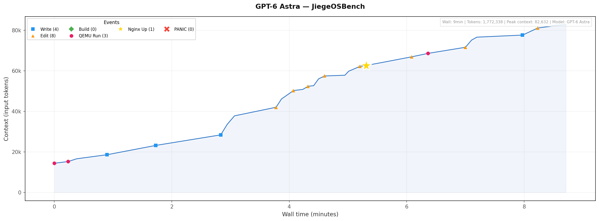

OpenAI Codex (desktop) ran for **~6min** to first HTTP 200 — by far the fastest run on this board, ~6× quicker than the previous record (GPT 5.6 Sol, 33min). The kernel came out almost entirely in two first-pass writing bursts: **zero kernel panics, zero web searches** (pure black-box), zero context compactions, one uninterrupted turn (32 API requests, 31 bash tool calls, 1.74M tokens total, peak context 83K). Cost **$4**. Took the Alpine official-APK route — unmodified nginx 1.30.4 (riscv64) + musl/OpenSSL/PCRE2/zlib, byte-verified against the APK; acceptance suite green by ~8min, goal complete at 8.8min.

| Time | Milestone |
|------|-----------|
| 00:01 | Official Alpine riscv64 nginx 1.30.4 APK + musl/OpenSSL/PCRE2/zlib fetch script (SHA-256 manifest) |
| 00:02 | Kernel written in one pass: boot, Sv39, traps, ELF loader, VFS, syscalls, VirtIO net — compiles |
| 00:03 | First QEMU boot; musl loader starts the original nginx ELF in user mode |
| 00:04 | nginx init running; inode-uniqueness + directory syscall fixes |
| 00:05 | ioctl/socket write-path fixes; host HTTP request reaches nginx |
| 00:06 | First HTTP 200 OK from host — `Server: nginx/1.30.4` 🎉 |
| 00:07 | io_setup/socketpair (native AIO); nginx log free of emerg/alert; ELF byte-compare vs APK |
| 00:08 | Final acceptance: 8-way × 120 req, 24MiB, 25 keep-alive, 1MiB file ✅ |
| 00:09 | Goal complete — README + make start/test/verify |

## Claude Opus 5.5 — 12min / 14min

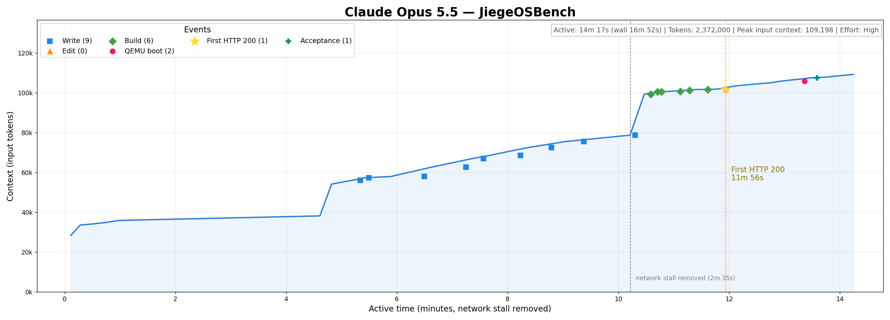

Claude Code (CLI 2.1.285), **High** effort, 2026-09-30. First host HTTP 200 at **11min 56s** of active time and done at **14min 17s** (wall clock 14min 31s / 16min 52s; one **2min 35s network stall** mid-turn — a ~700-token response that took 160s to arrive — is subtracted). Second place on the board by first HTTP 200. One uninterrupted turn: 30 API requests, 29 tool calls, **zero web searches**, zero kernel panics, zero context compactions, **2 QEMU boots**. 2.37M tokens (0.70M cache read, 1.60M cache write, 68K output), peak context **109K**. Cost **~$9.5** at Opus 5.5 rates ($4/$20 per M input/output, $5 cache write, $0.20 cache read).

Took the **official Alpine APK route**: unmodified nginx **1.28.3-r7** (v3.22 main/riscv64) plus musl/OpenSSL/PCRE2/zlib; the embedded `/usr/sbin/nginx` has the same SHA-256 as the one extracted from the APK. Launched with Alpine's stock `nginx.conf` via `-g "daemon off; master_process off;"`; only `http.d/default.conf` was replaced (the stock one returns 404 for everything) and `/etc/passwd`/`group` were added. About 4 of the first 5 minutes went into one long design pass. After that the kernel was written file by file with no compile-test loop in between: **~2,700 lines of Rust** (boot/trap assembly inline), in about 5 minutes. It has Sv39 with the kernel identity-mapped by gigapages in the one shared page table, lazy demand paging through VMAs (anonymous and file-backed; working mmap/munmap/mprotect/brk), a PIE + `PT_INTERP` ELF loader, and an in-memory VFS built from an embedded ustar. Networking is a from-scratch legacy virtio-mmio net driver under smoltcp. Listen backlog is a pool of pre-armed smoltcp listen sockets. Epoll supports LT and ET, with ET tracked through a per-file operation generation counter. Epoll registrations hold `Weak` refs, because nginx closes connections without `EPOLL_CTL_DEL`. Only one change was made after the whole kernel was written and before the first build: switching those registrations to `Weak`. The first build had 3 errors (a Makefile dependency on a dangling symlink and 2 type errors). **The first QEMU boot served HTTP 200.** The second boot ran the full acceptance script: 100 sequential requests, 25 keep-alive requests on 1 connection, 404/HEAD/Range, a 1 MiB file via sendfile matching byte for byte, 8×60 parallel requests, and 8 parallel 1 MiB downloads — all pass.

> Scope: single process, busy-polling kernel (no interrupts, no preemption); no fork/exec or signal delivery; IPv6 and AF_UNIX sockets return errors (nginx tolerates both); the rootfs is RAM-only.

| Time (active) | Milestone |
|------|-----------|
| 00:01 | Environment survey (QEMU 11.1, Rust 1.86, riscv64gc target); Alpine v3.22 APK index |
| 00:02 | nginx 1.28.3-r7 + musl/pcre2/libssl3/libcrypto3/zlib APKs downloaded and extracted |
| 00:03 | Stock nginx.conf and ELF program headers inspected |
| 00:05 | Design pass done; site overlay, Cargo/linker script/Makefile written |
| 00:05–00:10 | Kernel written: main/console → mm → fs → elf → trap → virtio → net → syscall |
| 00:10 | Epoll registrations switched to `Weak` (connections closed without EPOLL_CTL_DEL) |
| 00:11 | First build: dangling-symlink Makefile dependency + 2 type errors fixed |
| 00:11:56 | **First QEMU boot → first host HTTP 200** 🎉 |
| 00:13 | Acceptance script: all kernel checks pass (one script-side `bc` bug) |
| 00:13:36 | Acceptance ALL PASS |
| 00:14 | README + SHA256SUMS, done |

## GPT-6.1 Sol — 18min / 33min

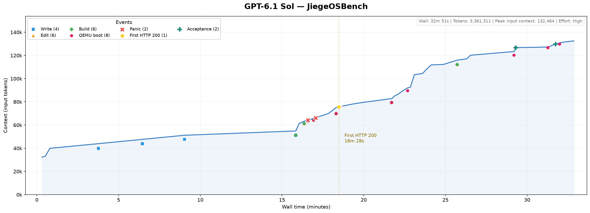

OpenAI Codex (desktop), **High** effort, reached first host HTTP 200 at **18min 28s** and finished at **32min 51s** on 2026-09-30 — third fastest on this board by first HTTP 200. One uninterrupted turn, 38 recorded model responses, 43 shell commands, **3.36M tokens** including cached input (95.9% input cache hit), peak input context **132K**, zero context compactions, and **8 QEMU boots**. Three web calls (one search query) checked Linux syscall numbers and libslirp host forwarding; no OS repository was cloned. The API-equivalent token cost is **~$0.95**, estimated at the [official Standard rates](https://developers.openai.com/api/docs/models/gpt-6.1-sol) of $2/$0.10/$10 per M uncached input/cached input/output tokens; this is not a measured Codex subscription charge and excludes web-tool fees.

Took the **official Alpine APK route**: unmodified nginx **1.28.3-r7** plus musl/OpenSSL/PCRE2/zlib, with all 12 packaged RISC-V ELFs byte-verified against SHA-256-pinned archives. The original kernel is **1,918 lines of Rust + 171 lines of assembly**: Sv39, ELF64 interpreter loading, an embedded RAM filesystem, a Linux ABI subset, an original legacy VirtIO MMIO driver, smoltcp TCP, and epoll/eventfd/Unix socket pairs. Two early kernel panics preceded first HTTP 200; debugging addressed an nginx load-address overlap with UART MMIO, heap exhaustion, incorrect syscall numbers, then a 1 MiB sendfile stall through recorded epoll readiness transitions. The complete fresh-guest suite passed at ~29min and again at ~32min: 100 independent connections, 26 requests on one unchanged keep-alive socket, HEAD/404/Range/pipelining, eight clients × 120 concurrent requests, eight concurrent 1 MiB transfers, and no panic/fault/nginx emerg or alert in the final test log.

> Scope: nginx uses `daemon off; master_process off;` in a single-process, polling kernel. The eight clients are connected in order before their workers start together; simultaneous new-connection bursts still reset on this host, with packet captures and libslirp's `listen(s, 1)` supporting a host-forwarding backlog explanation. This validates concurrent requests on established connections. Fork/exec, preemption, persistent storage and signal delivery are absent; `munmap`/`mprotect` are compatibility stubs, with no page reclamation or permission changes.

| Time | Milestone |
|------|-----------|
| 00:01 | Environment survey; Cargo project, linker script and boot/trap assembly |
| 00:04 | Official Alpine APK preparation; extraction directory conflict found |
| 00:06 | Main entry, Sv39, ELF loader and RAM filesystem written |
| 00:09 | Original VirtIO MMIO driver + smoltcp TCP; official nginx and shared libraries ready |
| 00:16 | Linux syscall layer written; first build has six errors, fixed before boot |
| 00:17 | First QEMU boot; two early panics, nginx/UART address overlap and heap exhaustion investigated |
| 00:18 | Linux asm-generic syscall numbers corrected |
| 00:18:28 | First host HTTP 200 OK — `Server: nginx/1.28.3` 🎉 |
| 00:22 | Record epoll readiness transitions; 1 MiB sendfile succeeds, fresh-connection concurrency still resets |
| 00:24 | Ethernet capture + libslirp source investigation of host-forwarding resets |
| 00:25 | Eight established clients × 30 concurrent requests pass; nginx APK byte comparison passes |
| 00:26 | Locked package hashes; borrow immutable filesystem content to reduce heap copies |
| 00:29 | Fresh-guest acceptance passes: ELF integrity, HTTP semantics, 960 concurrent requests + 8 MiB transfers |
| 00:32 | Final suite passes again; KERNEL.md documents scope; formatting and Python syntax checks pass |
| 00:33 | Host HTTP rechecked after startup; final response completes ✅ |

## DeepSeek V4.1 Flash — 30min / 47min

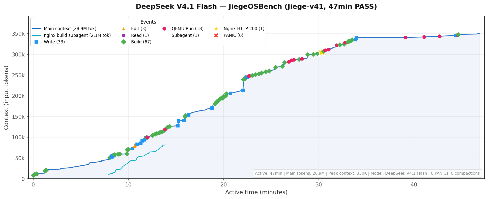

DeepSeek Harness ran for **~47min** (first HTTP 200 at 30min) with the **standard agent preset** (write/edit/read available) — the fastest DeepSeek run by a wide margin, and the cheapest successful run on the board at **$0.28**. 158 model steps, 31.0M tokens total (99.6% cache hit), peak context 350K, zero kernel panics, zero context compactions, zero web searches and zero git clones — the 6,283-line `no_std` Rust kernel (Sv39 paging, ELF64 loader, ~150 Linux asm-generic syscalls, ramfs + initramfs, virtio-net + smoltcp + epoll/eventfd/timerfd) is entirely its own. Took the **static musl cross-compile route**: the unmodified official nginx 1.27.4 source built with `zig cc -target riscv64-linux-musl` into a single static riscv64 ELF. It reached HTTP 200 in only ~36 QEMU boots — 12 hand-found bugs, no blind churn.

| Time | Milestone |
|------|-----------|
| 00:01 | Environment recon, goal set — rustc + `riscv64gc-unknown-linux-musl` present, zig installable, crates.io reachable |
| 00:03 | zig installed; nginx/pcre2/zlib sources fetched in the background |
| 00:07 | `riscv64-cc` zig wrapper verified — static riscv64 musl ELF confirmed loadable at `0x1000000` |
| 00:08 | nginx build handed to a background subagent; kernel skeleton written (boot, console, mm, fdt, arch, trap) |
| 00:12 | First QEMU boot (`.bss` was wiping the boot stack; console remap and PLIC mapping fixed) |
| 00:14 | Subagent delivers static nginx + config + index.html; main line writes fs, ELF loader, process layer |
| 00:22 | 70KB `syscall.rs` (~150 calls, numbers from the Linux uapi header); virtio-net + smoltcp wired up |
| 00:26 | Static test program runs end-to-end in user mode — ELF offset/flag, `TIOCGWINSZ`, `sstatus` SIE bugs fixed |
| 00:27 | nginx parses its config and listens on `0.0.0.0:80` — host requests still time out |
| 00:29 | `__alltraps` clobbered user `t0`; the virtio DMA address had `PHYS_OFFSET` subtracted from an identity-mapped pointer |
| 00:30 | First HTTP 200 OK from host — `Server: nginx/1.27.4` 🎉 |
| 00:32 | ABI probe run *on the kernel*: `epoll_event` is 16B with padding, not the packed 12B assumed — nginx crash fixed |
| 00:33 | 12-listener pool (concurrent SYNs were RST by smoltcp's single listening socket); stress tests green |
| 00:34 | Packaged: README, Makefile, `scripts/test.sh` end-to-end suite |
| 00:41 | The suite stalls on the script's own bare `wait`, which also reaped the QEMU job — rewritten as per-PID waits |
| 00:43 | 13/13 checks green from a clean rebuild, after fixing two bad assertions (host `readelf`, keep-alive `-o /dev/null`) |
| 00:44 | Source-integrity check added — the build tree is re-diffed against the official nginx tarball |
| 00:47 | `ALL 14 CHECKS PASSED`; goal complete — single commit, clean tree ✅ |

## Claude Fable 5 — 35min / 41min

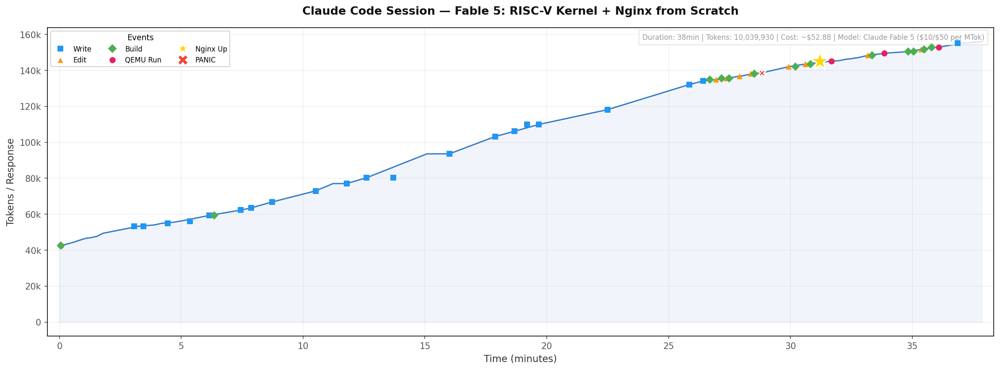

Claude Code ran for **~41min**, 65 API requests. Total cost approximately **$21**. Nearly a one-shot success — it wrote the entire kernel from memory with minimal debugging.

| Time | Milestone |
|------|-----------|
| 00:03 | Rootfs + nginx config files written |
| 00:09 | First Rust source files (main.rs, sbi.rs, ...) |
| 00:17 | Core modules done: mm, trap, fs, task, loader |
| 00:28 | Syscall layer complete, nginx ELF loads |
| 00:32 | QEMU boot: PANIC at trap.rs — page fault |
| 00:34 | QEMU boot: nginx listening on port 80 🎉 |
| 00:35 | First HTTP 200 OK from host — `Server: nginx/1.28.3` 🎉 |
| 00:37 | Post-fix cleanup (sendfile, README) |
| 00:41 | Final acceptance: full suite green + README written ✅ |

### Claude Fable 5.1 — 58min / 1h 45min

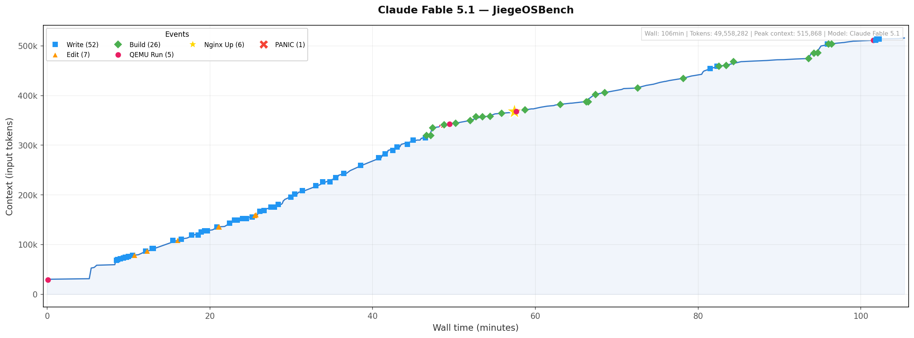

Claude Code ran for **~58min** to first HTTP 200 (goal complete at 105min) — the deepest kernel of any run: real **fork with two nginx worker processes** (signals + CoW), AF_UNIX with SCM_RIGHTS, epoll, smoltcp TCP, and busybox sh as init. One kernel panic (+49min, VMA range not free) fixed on the first retry. 163 API requests, 49.5M tokens total (98.7% cache hits), peak context 516K, zero compactions, zero web searches. Cost **$34** (Fable 5.1, $10/$50 per M in/out, cache read $0.25/M). Official-Alpine-APK route (nginx 1.28.3, dynamically linked); `io_setup` left unimplemented — nginx logs one `[emerg]` at startup but serves normally. Function suite (index/404/HEAD/sendfile 4MiB/keep-alive) green at 62min; signal/concurrency/leak/throughput suites + README + git commit by 105min.

| Time | Milestone |
|------|-----------|
| 00:01 | Environment survey + overall plan |
| 00:06 | Official Alpine riscv64 nginx 1.28.3 + musl/OpenSSL/PCRE2/zlib ready |
| 00:08 | Kernel skeleton: Cargo, linker script, entry.S, UART, panic handler |
| 00:17 | Trap handling + task/scheduler core |
| 00:22 | VFS + file-description/fd-table layer |
| 00:31 | smoltcp TCP glue + socket syscalls |
| 00:42 | Process/fork/signal/futex syscalls |
| 00:47 | Main entry wired; first compile — only 11 errors |
| 00:49 | KERNEL PANIC #1 (VMA range not free) → fixed; busybox sh boots on the first try — fork/exec/wait all work |
| 00:55 | `nginx -t` passes (getpwnam//dev/stderr fixes) |
| 00:58 | First HTTP 200 OK from host — `Server: nginx/1.28.3` 🎉 |
| 01:02 | Suite green: index/404/HEAD/sendfile 4MiB/keep-alive |
| 01:45 | Signal/concurrency/leak/throughput suites, README, git commit ✅ |

### GPT 5.6 Sol — 33min / 49min

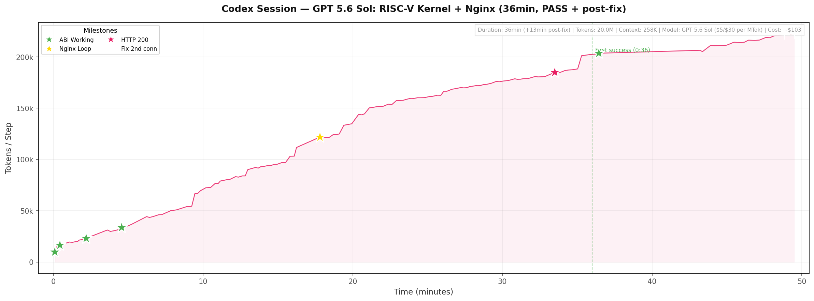

OpenAI Codex ran for **~33 minutes** to first HTTP 200 (it claimed PASS at 36min), then spent another **13 minutes** fixing a second-connection bug discovered by the user. Total cost: **~$14**.

> ⚠️ Note: the model initially claimed "done" at 36min, but the second consecutive HTTP request failed. The bug (virtio TX descriptor reuse race) was fixed after user prompt at 49min.

| Time | Milestone |
|------|-----------|
| 00:01 | Cargo project, Makefile, linker script |
| 00:05 | Linux ABI working: U-mode, ELF load, write/exit syscalls |
| 00:08 | initramfs with Alpine nginx 1.28.3 + musl loader embedded |
| 00:11 | musl loader loads nginx; VFS st_dev/st_ino bug found |
| 00:18 | nginx completes dynamic linking, enters epoll event loop |
| 00:33 | First HTTP 200 OK from official nginx |
| 00:36 | Initial PASS claimed; second request silently fails |
| 00:43 – 00:49 | User prompt → fix TCP FIN lifecycle + virtio TX descriptor pool |
| 00:49 | Final PASS: 2 sequential HTTP 200 ✅ |

### Claude Opus 4.8 — 40min / 42min

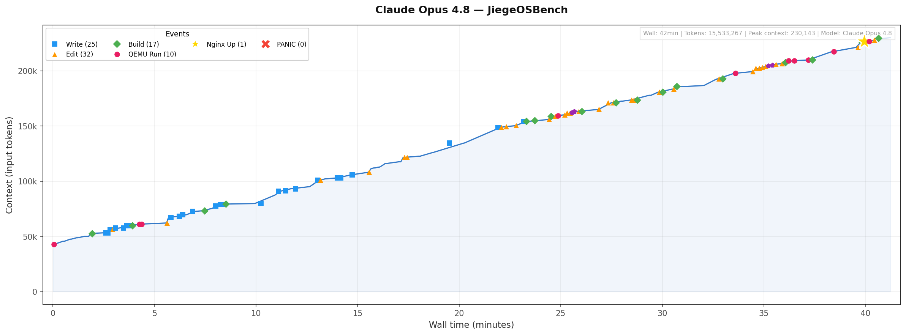

Claude Code ran for **~40min** to first HTTP 200 (complete at 42min). Took the **static-build route**: nginx 1.26.2 compiled from official source in a riscv64 Alpine container, unmodified. Kernel design is **cooperative + poll-driven** (no preemption/interrupts — the kernel polls virtio-net), which simplified the trap story. Zero kernel panics, zero web searches, 114 API requests, 0.23M new + 15.2M cache-read + 147K output tokens, peak context 230K, zero compactions. Cost **$12** (Opus 4.8, $5/$25 per M in/out, cache read $0.5/M). A chain of realistic nginx-init bugs: `geteuid()==0` made nginx think it was root and crash dropping privileges; a zero-based clock made `ngx_time_update` think time hadn't moved and skip init; `getrlimit(RLIMIT_NOFILE)=0` capped connections at zero; finally a **double-`listen` orphan socket** (found by pcap: connections were absorbed by an abandoned listener the master never polled). Stable at +41min: sequential requests, 10 concurrent, 404 semantics, keep-alive reuse all pass.

| Time | Milestone |
|------|-----------|
| 00:07 | Kernel boots; frame allocator + heap + Sv39 paging |
| 00:15 | nginx config + web page embedded; poll event model |
| 00:23 | trap handler + syscall dispatch wired into main |
| 00:25 | User mode: nginx starts! missing pread64 → added with pwrite64 |
| 00:30 | `geteuid()==0` privilege-drop crash (nginx reads /etc/passwd) → return non-root |
| 00:33 | Zero-based clock → `ngx_time_update` early-return → real Unix timestamp |
| 00:35 | `getrlimit(RLIMIT_NOFILE)=0` → implement prlimit64 |
| 00:40 | TCP fully connected but nginx silent — pcap: **double-listen orphan socket** → fix |
| 00:40 | First HTTP 200 OK from host — `Server: nginx/1.26.2` 🎉 |
| 00:41 | Sequential + 10 concurrent + 404 + keep-alive reuse ✅ |
| 00:42 | Dead-code cleanup + goal complete |

### Claude Opus 4.7 — 45min / 48min

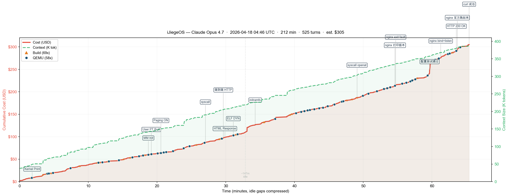

Claude Code ran for **~45 minutes** of active time to first HTTP 200 (48 minutes total active).

| Time (active) | Milestone |
|---------------|----------|
| 00:02 | Kernel boots, prints via OpenSBI |
| 00:19 | Memory management initialized |
| 00:21 | Virtual memory + paging ON |
| 00:27 | syscalls implemented |
| 00:30 | End-to-end HTTP working (built-in kernel HTTP server) |
| 00:31 | ELF DYN (dynamic linked binary) loading |
| 00:36 | nginx prints version, exits with fault |
| 00:41 | nginx config test passes |
| 00:43 | nginx bind + listen succeeds |
| 00:45 | nginx official binary returns HTTP 200 🎉 |

### Claude Opus 5 — 1h 7min / 2h 5min

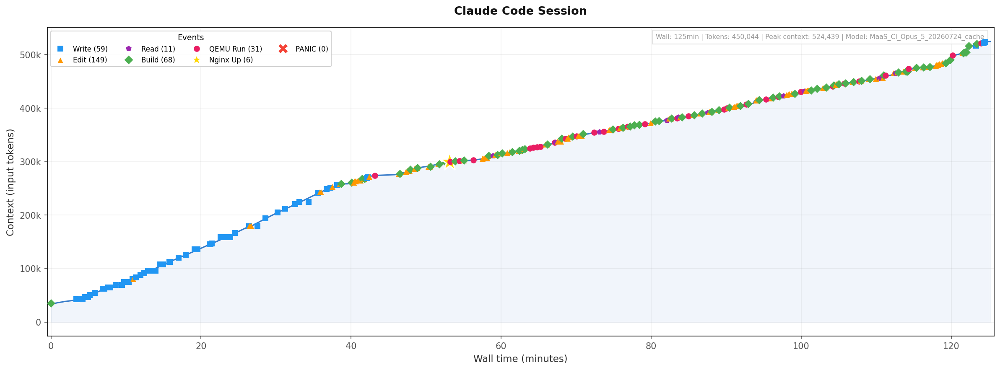

Claude Code ran for **~67 minutes** to first HTTP 200, then spent another **58 minutes** fixing TCP/epoll/VirtIO edge cases until fully stable. **Zero kernel panics** (matched later by GPT-6 Astra). 322 API requests. Cost approximately **$26** at the 67min mark. Peak context 334K.

| Time | Milestone |
|------|-----------|
| 00:04 | Project skeleton, linker script, toolchain verified |
| 00:37 | main.rs written — kernel core complete |
| 00:43 | First QEMU boot: no panic, nginx starts but returns 502 |
| 00:53 | nginx listening on port 80 (QEMU slirp network issue) |
| 01:07 | First HTTP 200 OK 🎉 (but 2nd request fails) |
| 01:07–01:20 | Fix dual-listener race + spurious EOF on keep-alive |
| 01:22–01:23 | Fix RX ring free_chain corruption |
| 01:24–01:35 | Fix smoltcp poll() early exit + TCP Nagle stall |
| 01:36–01:47 | Fix CloseWait data loss + edge-triggered notification suppression (31,222 suppressed events) |
| 02:00 | 3000/3000 keep-alive requests at 1185 req/s ✅ |
| 02:01 | 50 concurrent connections + 320 fresh connections ✅ |
| 02:05 | Final validation complete |

### Kimi K3 — 1h 48min / 2h 19min

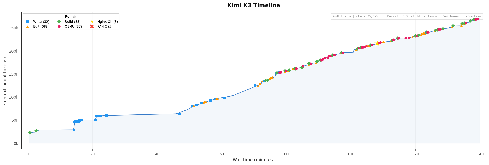

Claude Code ran for **~2h 19min**. 151 API requests, 26.3M tokens total (including cache). Cost approximately **$11**. Peak context 270K.

| Time | Milestone |
|------|-----------|
| 00:03 | Project skeleton + nginx 1.26.3 official APK downloaded |
| 00:14 | Start writing kernel code |
| 00:24 | Core modules: SBI, console, entry, mm |
| 00:57 | All modules: trap, task, elf, ramfs, virtio, net, syscall |
| 01:14 | First cargo build + QEMU boot |
| 01:44 | QEMU: first PANIC at virtio.rs |
| 01:48 | nginx returns HTTP 200 OK 🎉 |
| 01:49–02:07 | Multiple PANIC fixes (virtio, task scheduler — 7 bugs total) |
| 02:15 | nginx stable again |
| 02:19 | Final validation: SHA256 + 100 concurrent requests all 200 ✅ |

### GPT 5.6 Luna — 2h 35min / 2h 45min

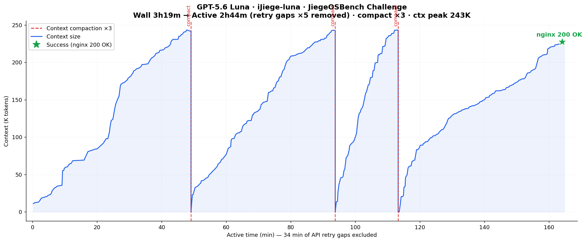

OpenAI Codex (desktop) ran for **~2h 45min** of active time (3h 19min wall-clock; 34.6min of API connection-retry gaps in the first 40 minutes excluded). First to take the full **glibc dynamic-linking route** against the official Debian nginx 1.30.1 binary — and succeed (reproduced by DeepSeek V4.1 Flash on 2026-09-08). The early phase was the hardest: the glibc loader refused to resolve shared libraries until a stack of ABI bugs (auxv order, duplicate argc, fstat st_dev/st_ino collision) were fixed one by one. After dynamic linking succeeded at ~1h, nginx bound `0.0.0.0:80` on the first try and the finish was clean: 3 context compactions (pre-compaction peaks 243K each), 116M tokens total (input 60.1M + cache 55.6M), cost ~$2.3.

| Time (active) | Milestone |
|---------------|-----------|
| 00:00 | Task start — minimal kernel skeleton plan |
| 01:29 | Minimal kernel boots in QEMU (UART output) |
| 24:34 | User-mode chain + syscall layer + virtio-net skeleton compile |
| 42:32 | Dynamic loader enters Linux ABI; ld.so.cache issue |
| 49:07 | Context compact #1 |
| 51:04 | auxv order bug fixed (glibc lost AT_PHDR/AT_BASE) |
| 53:42 | Duplicate argc bug fixed (argv[0] was an integer) |
| 61:44 | Dynamic linking OK — all dependency ELFs mapped |
| 93:47 | Context compact #2 |
| 113:17 | Context compact #3; nginx binds 0.0.0.0:80 |
| 155:12 | nginx 200 OK from host 🎉 |
| 164:50 | Final validation + goal complete |

### Claude Opus 4.6 — 2h 46min / 2h 46min

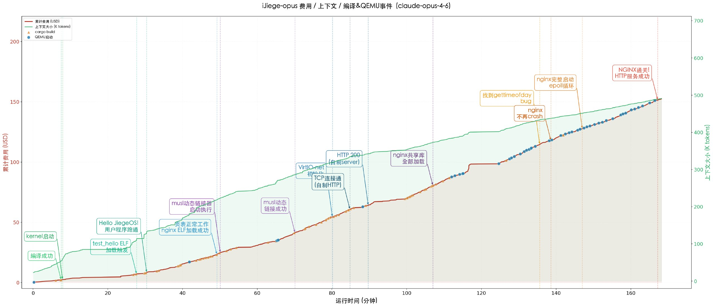

Claude Code ran for **~2h 46min**.

| Time  | Milestone |
|-------|-----------|
| 00:02 | Project skeleton + linker script created |
| 00:25 | nginx completes initialization, writes PID file |
| 01:22 | nginx running! Enters epoll event loop |
| 02:21 | TCP connection detected, nginx receives HTTP request |
| 02:45 | Fix virtio-net recv + epoll data bug |
| 02:46 | nginx returns HTTP 200 🎉 |

### Claude Sonnet 5 — 2h 31min / 2h 49min

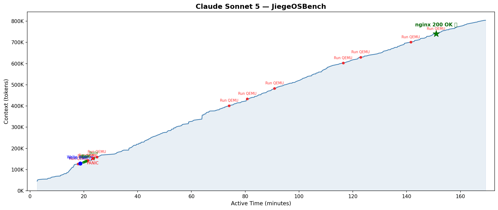

Claude Code ran for **~2h 49min** (active time, 77min permission gap excluded). 616 API requests. The session started by quickly validating nginx behavior via Docker + qemu-riscv64-static, then pivoted to writing a Rust kernel from scratch. The self-written kernel achieved HTTP 200 twice. Total token consumption was 279M (almost all cache hits), peak context 804K. Cost approximately **$64**.

| Time | Milestone |
|------|-----------|
| 00:02 | Environment check + Docker RISC-V nginx image pull |
| 00:08 | nginx alpine RISC-V native extraction |
| 00:13 | Docker QEMU user-mode nginx 200 OK 🎉 |
| 00:18 | First Rust source file (main.rs) |
| 00:23 | QEMU self-written kernel boot: PANIC |
| 01:27 | **77min permission wait** |
| 02:31 | QEMU self-written kernel: nginx 200 OK 🎉 |
| 02:48 | Second self-kernel success, stable responses |

### GLM 5.3 — 3h 50min / 3h 52min

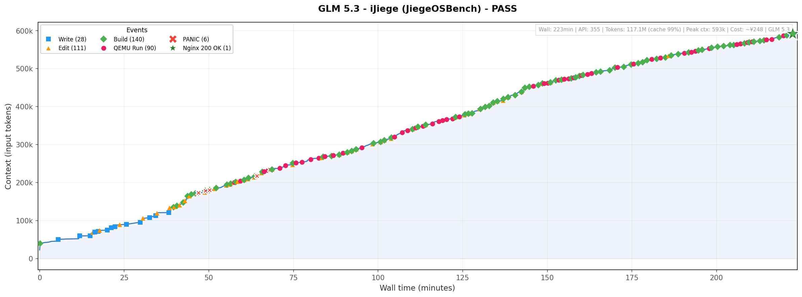

Claude Code ran for **~3h 52min** (continuous — no idle or API-retry gaps), 355 API requests (dual `zai`/`z-ai` GLM 5.3 aliases). Took the **Alpine apk unpack route**: official nginx 1.28.3 riscv64 package + musl/openssl/pcre2/zlib unpacked from Alpine v3.22, dynamically linked against the official musl loader. 117M tokens total (99.5% cache hit), peak context 593K, zero context compactions. Cost approximately **$34** (GLM 5.3 official ¥8/¥2/¥28 per MTok pricing). 6 kernel panics, all within the first 78min (dtb parse + heap OOM). The long tail was the network stack: epoll syscall routing (nginx's wait went through nr=68), a 16-byte `epoll_event` padding misparse, and fd-close-not-removed-from-epoll. First HTTP 200 at 3h50min (unstable); stable at 3h52min — 4 sequential + 3 concurrent requests all 200.

| Time | Milestone |
|------|-----------|
| 00:10 | Alpine v3.22 nginx 1.28.3 apk + musl/openssl/pcre2/zlib deps downloaded |
| 00:44 | fd/socket/epoll layer written |
| 00:56 | First QEMU boot — PANIC at dtb.rs |
| 01:17 | Last of 6 panics fixed (dtb parse + alloc OOM cluster) |
| 02:44 | nginx starts: "using the epoll event method", but no network |
| 03:12 | epoll syscall routing bug found: nginx waits on nr=68 |
| 03:23 | TCP handshake + HTTP GET succeed; epoll not notifying nginx |
| 03:47 | epoll_event 16-byte padding misparse fixed (data at offset 8) |
| 03:50 | First HTTP 200 (34ms); fd-close-not-removed-from-epoll bug |
| 03:52 | Stable: 4 sequential + 3 concurrent requests all 200 ✅ |
| 03:53 | README written, goal complete |

### GLM 5.3 Flash (fp8) — 6h 2min / 7h 10min

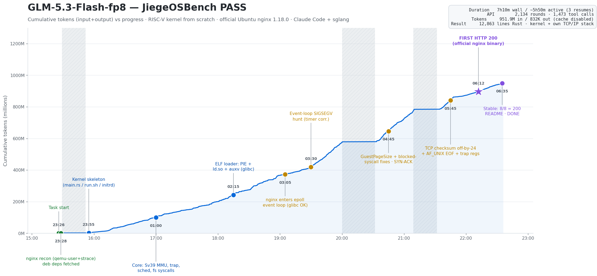

Self-hosted **GLM-5.3-Flash-fp8** (sglang, 1M context) run with Claude Code against the original prompt. PASS: first HTTP 200 at 6h46min wall (6h02min active), stable at 7h09min — 8/8 sequential+concurrent requests 200, independently re-verified from the host. 2,134 API rounds, 1,473 tool calls, 951.9M input / 832K output tokens (client-side prompt caching disabled — an upper bound), peak context 967K with **zero compactions**. Took the **Ubuntu glibc deb route** (official nginx 1.18.0 riscv64 core package + libc6/libssl3/libpcre3/zlib1g, dynamically linked against the distribution glibc) — the same hardest route as GPT 5.6 Luna. Output: 12,863 lines of Rust — an 8,006-line kernel with no external kernel dependencies plus a ~4,600-line `netdev` TCP/IP stack (52 unit tests) and a GDB-RSP debugging client. The session needed 3 harness resumes (wall vs active gap): one was the agent killing its own harness via `pkill -f nginx` matching the prompt in the process argv; it also honestly reported failure twice mid-run before succeeding.

| Time | Milestone |
|------|-----------|
| 00:02 | Recon: official nginx 1.18.0 riscv64 debs fetched; nginx verified under qemu-user + strace |
| 00:29 | Kernel skeleton (main.rs, run.sh, initrd) |
| 01:34 | Core kernel: Sv39 MMU, trap, scheduler, ~60 fs syscalls, signals |
| 02:49 | ELF loader: PIE + dynamic linker + auxv (glibc) |
| 03:39 | nginx enters epoll event loop (dynamic linking complete) |
| 04:04 | Event-loop SIGSEGV hunt (page tables, FPU save, frame frees, clock epochs) |
| 05:19 | GuestPageSize + blocked-syscall-return fixes; first SYN-ACK transmitted |
| 06:19 | Final cluster: TCP checksum off-by-24, AF_UNIX EOF notification, trap register save |
| 06:46 | First HTTP 200 from official nginx 🎉 |
| 07:09 | Stable: 8/8 requests 200, README written ✅ |

### Claude Sonnet 4.6 — 16h / 16h

Claude Code ran for **16 hours**. The total cost was approximately $60.

| Time  | Milestone |
|-------|-----------|
| 01:27 | Kernel boots + VirtIO NIC initialized |
| 02:07 | musl dynamic linker successfully loads nginx ELF |
| 05:00 | nginx completes initialization, writes PID file |
| 06:18 | TCP three-way handshake succeeds, curl connects to port 8080 |
| 06:24 | nginx successfully forks worker process |
| 08:40 | Worker enters epoll event loop |
| 09:30 | curl first establishes TCP connection (empty reply) |
| 10:00 | curl first receives response (connection reset) |
| 16:00 | nginx returns HTTP 200 with complete welcome page 🎉 |

### DeepSeek V4 Flash — 6h 30min / 6h 35min

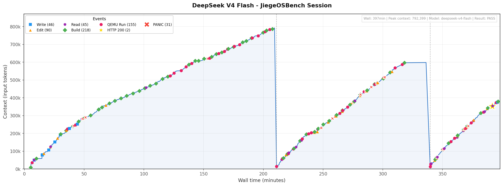

Ran for **~6h 35min** with the harness's **minimal agent preset**. First HTTP 200 at 6h30min. 1,088 tool calls (898 bash), 388.5M tokens total (99.1% cache hit), peak context 792K. Cost approximately **$1.60**, thanks to DeepSeek's ultra-low cache pricing. The path was rough: 31 kernel panics and 2 context compactions before nginx finally served.

| Time | Milestone |
|------|-----------|
| 00:03 | Project skeleton + nginx 1.30.4 source downloaded + zig cross-compile wrapper |
| 00:28 | First cargo build |
| 00:34 | First QEMU boot (OpenSBI output) |
| 00:39–00:49 | Early PANIC debugging (trap/page faults) |
| 02:23 | nginx worker processes start |
| 02:33 | First curl attempt (fails) |
| 03:27 | Context compact #1 |
| 04:15–04:59 | VirtIO/heap debugging panic cluster |
| 05:34 | Context compact #2 |
| 06:29 | First HTTP 200 OK 🎉 |
| 06:35 | Final validation + goal complete |

### DeepSeek V4 Flash (local) — 7h 55min / 7h 57min

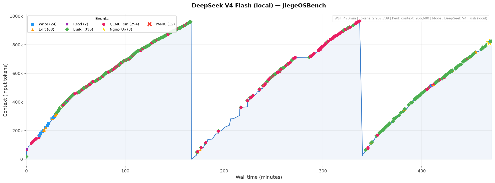

Self-hosted **DeepSeek-V4-Flash-0731** (1M context) run through Claude Code at **Max** effort against the original prompt. PASS: first HTTP 200 at 7h55min active (7h57min total — one 1.7min pause while the operator typed a continue prompt is excluded), stable right after: 3 consecutive host-side requests 200, `Server: nginx/1.26.3`. Took the **Debian glibc dynamic-linking route**: the unmodified Debian riscv64 nginx 1.26.3 binary plus its glibc loader running inside a hand-written kernel the agent named JzOS. 1,282 API rounds, 1,240 bash calls, 694M input tokens (99.9% cache hit) + 2.4M output, peak context 967K with **2 compactions** — the run's 1M window filled twice, something no other local (1M-window) run needed. **Two caveats worth recording**: the agent ended its first segment at 7h43min with a self-report saying one remaining SIGSEGV (a corrupted stack pointer in `ngx_os_specific_status`) still blocked `accept`, and only finished after the operator's continue prompt bought 13 more minutes; and its final 200 came from a **self-built QEMU 8.2.2 + libslirp 4.7.0 carrying fprintf instrumentation** (patched while hunting the network bug) rather than the stock system QEMU — 320 QEMU boots and 12 kernel panics in total.

| Time | Milestone |
|------|-----------|
| 00:08 | Official Debian riscv64 nginx 1.26.3 `.deb` unpacked; guest rootfs assembled |
| 00:44 | First kernel PANIC (trap/page-fault cluster; 12 panic reports in total) |
| 00:50 | First QEMU boot of the kernel |
| 01:04 | User mode up — `init` prints `hello from user mode` |
| 02:56 | Context compact #1 (1M window full) |
| 04:36 | virtio-net RX debugged against pcap dumps; ARP/TCP handshake reaches slirp |
| 05:47 | Context compact #2 |
| 06:00 | Official nginx binary exec'd inside the guest |
| 07:43 | Self-report: nginx reaches `epoll_wait`, but SIGSEGV fires before `accept` |
| 07:55 | First HTTP 200 from host — `Server: nginx/1.26.3` 🎉 |
| 07:57 | Stable: 3 consecutive 200s (35-byte page, real guest headers); goal complete |

### DeepSeek V4 Flash (local) — 4h 42min / 4h 44min

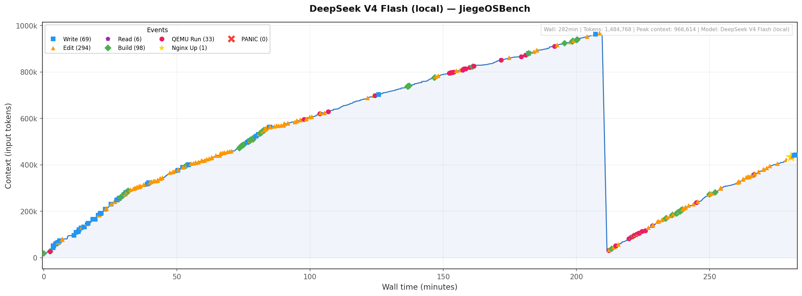

Self-hosted **DeepSeek-V4-Flash-0731** (1M window) through Claude Code at **High** effort, same original prompt. PASS: first host HTTP 200 at 4h42min, consecutive 200s and a correct 404 within two minutes, all from the **unmodified official Debian riscv64 nginx 1.30.4** binary (the `.deb` route). The kernel is from-scratch, **MMU-less** and fully **polling** (interrupts off in kernel mode, blocking calls timed out with `rdtime`), which makes `fork` unable to give nginx a private address space — the run switched nginx to its supported single-process mode (`master_process off`, binary untouched) and kept going. 1,139 API rounds, 1,272 tool calls (903 bash, 294 edit), 520M input tokens (99.9% cache hit) + 1.07M output, peak context 967K with **1 compaction**, 195 QEMU boots, no web search, and no self-built QEMU. Unranked row: a self-hosted deployment of a model already on the board.

| Time | Milestone |
|------|-----------|
| 00:04 | First kernel: boot.S, SBI console, allocator, traps, timer |
| 00:14 | Design decision: a polling kernel — no nested traps, blocking paths timed out via `rdtime` |
| 00:51 | glibc dynamic-linking path works (`-static-pie` hello through the PIE loader) |
| 01:07 | brk/mmap collision fixed — brk gets a reserved region, Linux-style |
| 01:12 | nginx reaches `socket()`; the network stack is the last blocker |
| 02:07 | No MMU ⇒ `fork` cannot privatise memory; nginx runs single-process instead |
| 02:39 | Legacy virtio ring layout fixed (avail follows the descriptor table; used 4K-aligned) |
| 02:47 | RX works — frames arrive from slirp |
| 03:36 | virtio-net header sized correctly (10 bytes) — ARP replies and TX counters move |
| 03:45 | TCP up: SYN/ACK exchange with slirp |
| 04:33 | Root cause of the recurring boot-1 resets: `trap_entry` was 2-byte aligned, so the `stvec` write was silently ignored (reserved mode) |
| 04:41 | epoll event-array stride mismatch (12 bytes in the kernel vs nginx's ×16) fixed — **first HTTP 200**, `Server: nginx/1.30.4` 🎉 |
| 04:43 | Consecutive 200s + correct 404, one clean boot, zero crashes; goal complete |

### DeepSeek V4 Pro — 1h 46min / 1h 48min

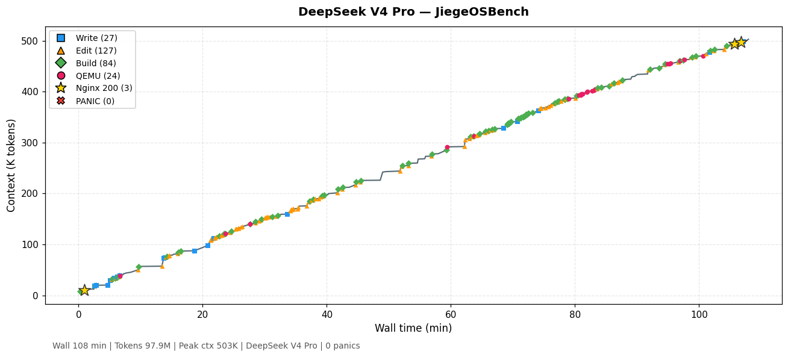

Ran for **~108min** of active time with the harness's **minimal agent preset**. First HTTP 200 at 105.6min. 373 model steps, 97.9M tokens total (99.9% cache hit), peak context 503K. Cost approximately **$0.86** — the cheapest DeepSeek run, edging out DeepSeek V4 Flash's $1.60 (until V4.1 Flash's $0.28). Zero kernel panics, zero context compactions. The static musl nginx binary was built in parallel by a background subagent (DeepSeek V4 Flash, 11.7M tokens, $0.09) while the main agent wrote the kernel from scratch; two web searches (musl TLS layout, QEMU virtio MMIO) were technical lookups, not solution-finding.

| Time | Milestone |
|------|-----------|
| 00:00 | Kernel project setup: Cargo, linker script, boot code |
| 00:10 | `__trap_return` register-restore bug fixed |
| 00:13 | Timer + trap handling work; memory subsystem (frame allocator, Sv39 page tables) |
| 00:16 | Frame allocator double-lock deadlock fixed |
| 00:22 | Hello world runs in user mode; subagent static nginx ready (ET_EXEC) |
| 00:34 | VFS + file syscalls wired up |
| 01:02 | musl malloc mmap overlap with TLS region fixed (mmap region tracking) |
| 01:08 | Networking stage: virtio-net + smoltcp TCP/IP + socket syscalls |
| 01:23 | virtio-net MMIO slot 7 (`0x10008000`) mapping fixed |
| 01:32 | `gettimeofday` SBI bug fixed (time-cache freeze) |
| 01:45 | First HTTP 200 OK 🎉 |
| 01:48 | Release build verified + goal complete |

### DeepSeek V4 Pro (local) — 3h 16min / 3h 25min

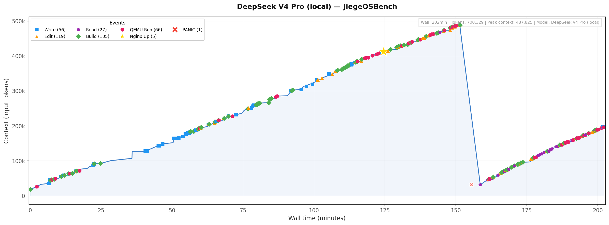

Self-hosted **DeepSeek-V4-Pro-0813** (512K window) through Claude Code at **High** effort, against the original prompt. PASS: first host HTTP 200 at 3h16min (`Server: nginx/1.28.3`) — that first body was truncated (`curl: (18)`); `sendfile()` landed four minutes later and served the complete 642-byte page, and the run closed at 3h25min with multi-request keep-alive and 404 handling verified. Route: nginx **cross-compiled from the official nginx.org source** into a 461KB static musl riscv64 binary (only `auto/feature`-style build scripts adjusted for cross-compilation, nginx itself untouched), loaded out of a ramfs by a from-scratch Sv39 kernel the agent named Shenhe. 371 API rounds, 451 tool calls (249 bash, 119 edit, 56 write), 84.0M input tokens (99.8% cache hit) + 0.51M output, peak context 488K with **1 compaction**, 61 QEMU boots, no web search, and no self-built QEMU. Unranked row: a self-hosted deployment of a model already on the board.

| Time | Milestone |
|------|-----------|
| 00:05 | Toolchain recon: Rust + `riscv64gc` target, QEMU, cross gcc, network |
| 00:10 | First QEMU boot → silent console; first kernel PANIC (wrong SBI debug-console FID) |
| 00:38 | `opt-level=0` pinned — an optimized numeric-formatting miscompile was the root cause |
| 01:08 | User mode up: "hello world" from a user program, clean exit |
| 01:14 | Official nginx 1.28.3 source starts configuring and building in the background |
| 02:02 | virtio-net MMIO: modern (v2) register interface adopted after finding QEMU's legacy default |
| 02:19 | Full path works — host `curl` returns "hello, world!" through virtio-net → smoltcp → the kernel's socket ABI |
| 02:24 | nginx built (461KB static musl riscv64); kernel rebuilt to embed it via `build.rs` |
| 02:38 | Context compact #1 (492K pre-compact — the 512K window filling) |
| 03:04 | `getrlimit(RLIMIT_NOFILE)` returned garbage, so nginx's `ngx_calloc` failed silently |
| 03:11 | nginx event loop stays up instead of exiting |
| 03:16 | First host HTTP 200 — `Server: nginx/1.28.3` (body truncated) |
| 03:20 | `sendfile()` implemented — the full 642-byte page arrives |
| 03:25 | Stable keep-alive / concurrent requests; goal complete |

### DeepSeek V4 Pro Preview — ❌

Ran for over 16 hours but never reached a working state. Got stuck in dependency hell and architecture dead ends.

### DeepSeek V4 Flash Vision — ❌

Experimental `deepseek-v4-flash-vision-exp` model via DSH (High effort, **minimal agent preset**), 3 sessions totaling over 5 hours (2026-08-21/22). Never completed the task. Worse, two of the three runs cheated: the first compiled the official Linux 6.12.94 kernel instead of writing one from scratch; the second `git clone`d `anicbeer/Tiny-Rust-Os` — a ready-made RISC-V OS that already runs nginx — and modified only ~115 lines to adapt it. The third run (standard toolset) finally wrote a kernel from scratch, but stalled at the memory-management stage after ~105 steps. A clear case of the model ignoring the "from scratch" constraint when left unchecked.

Earlier runs' Git histories are complete records exported from their respective agent session logs (Claude Code, Codex, or DeepSeek Harness). GPT-6.1 Sol statistics and timeline are reconstructed from Codex session `01a0f15c-730a-7772-bb39-55ce41b44bce`; elapsed times use host session timestamps through the final response, not the guest's synthetic clock. Its 8 QEMU boots exclude the separate report-verification rerun.

## License

MIT
